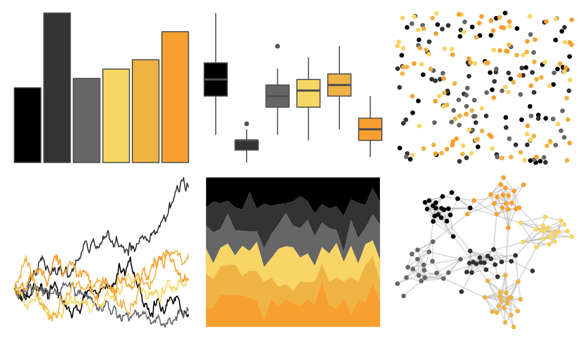

# beyonce - X34 

::: columns
::: {.column width="50%"}

**Github**

[dill/beyonce](https://github.com/dill/beyonce)
:::

::: {.column width="50%"}

**CRAN**

Not on CRAN
:::
:::

<hr> 

Use with [paletteer](https://emilhvitfeldt.github.io/paletteer/) package:

```r
library(paletteer)
paletteer_d("beyonce::X34")
```

Use raw:

```r
c("#000000FF", "#333333FF", "#666666FF", "#F8D564FF", "#EFB344FF", "#F8A02EFF")
``` 

 

<br>

# Related Palettes

<div class="list" style="display: grid; grid-template-columns: auto auto auto;"> <figure class="figure">
<a href="../../amerika/Dem_Ind_Rep3/"> </a>
</figure> <figure class="figure">
<a href="../../colRoz/p_breviceps/"> </a>
</figure> <figure class="figure">
<a href="../../lisa/MiltonAvery/"> </a>
</figure> <figure class="figure">
<a href="../../lisa/GiorgiodeChirico/"> </a>
</figure> <figure class="figure">
<a href="../../beyonce/X115/"> </a>
</figure> <figure class="figure">
<a href="../../trekcolors/breen/"> </a>
</figure> <figure class="figure">
<a href="../../poisonfrogs/Ribanded/"> </a>
</figure> <figure class="figure">
<a href="../../yarrr/ohbrother/"> </a>
</figure> <figure class="figure">
<a href="../../futurevisions/titan/"> </a>
</figure> <figure class="figure">
<a href="../../colRoz/xantho/"> </a>
</figure> <figure class="figure">
<a href="../../fishualize/Ostracion_cubicus/"> </a>
</figure> <figure class="figure">
<a href="../../soilpalettes/vitrixerand/"> </a>
</figure> 
</div>
