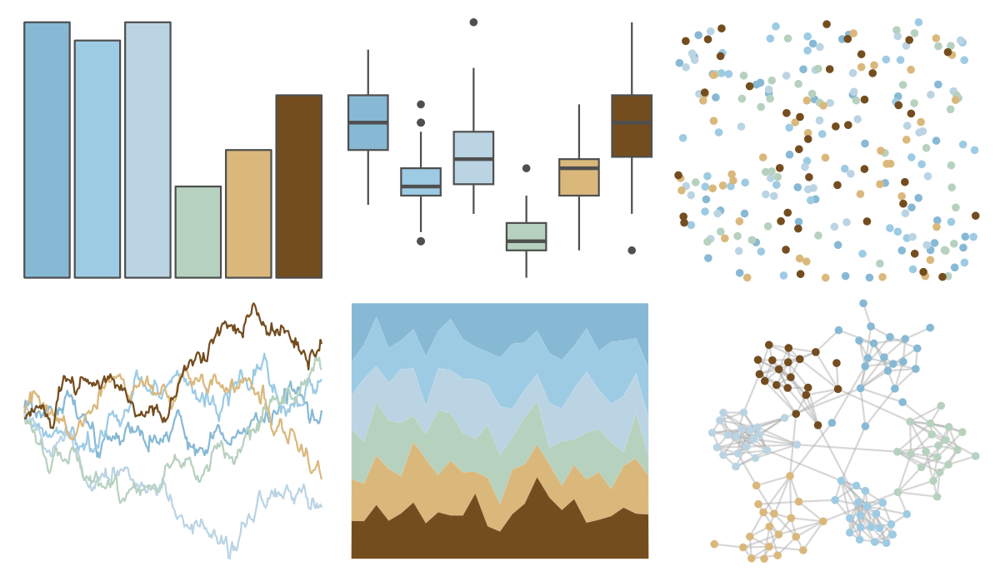

# beyonce - X35 

::: columns
::: {.column width="50%"}

**Github**

[dill/beyonce](https://github.com/dill/beyonce)
:::

::: {.column width="50%"}

**CRAN**

Not on CRAN
:::
:::

<hr> 

Use with [paletteer](https://emilhvitfeldt.github.io/paletteer/) package:

```r
library(paletteer)
paletteer_d("beyonce::X35")
```

Use raw:

```r
c("#87B9D5FF", "#9DCBE4FF", "#BBD4E4FF", "#B7D1BFFF", "#DAB87CFF", "#744D1FFF")
``` 

 

<br>

# Related Palettes

<div class="list" style="display: grid; grid-template-columns: auto auto auto;"> <figure class="figure">
<a href="../../awtools/a_palette/"> </a>
</figure> <figure class="figure">
<a href="../../nationalparkcolors/MtRainier/"> </a>
</figure> <figure class="figure">
<a href="../../lisa/SalvadorDali_1/"> </a>
</figure> <figure class="figure">
<a href="../../rcartocolor/Earth/"> </a>
</figure> <figure class="figure">
<a href="../../lisa/PaulKlee/"> </a>
</figure> <figure class="figure">
<a href="../../beyonce/X54/"> </a>
</figure> <figure class="figure">
<a href="../../beyonce/X129/"> </a>
</figure> <figure class="figure">
<a href="../../IslamicArt/konya/"> </a>
</figure> <figure class="figure">
<a href="../../ghibli/MarnieLight1/"> </a>
</figure> <figure class="figure">
<a href="../../calecopal/chaparral2/"> </a>
</figure> <figure class="figure">
<a href="../../colRoz/shark_bay/"> </a>
</figure> <figure class="figure">
<a href="../../fishualize/Mugil_liza/"> </a>
</figure> 
</div>
