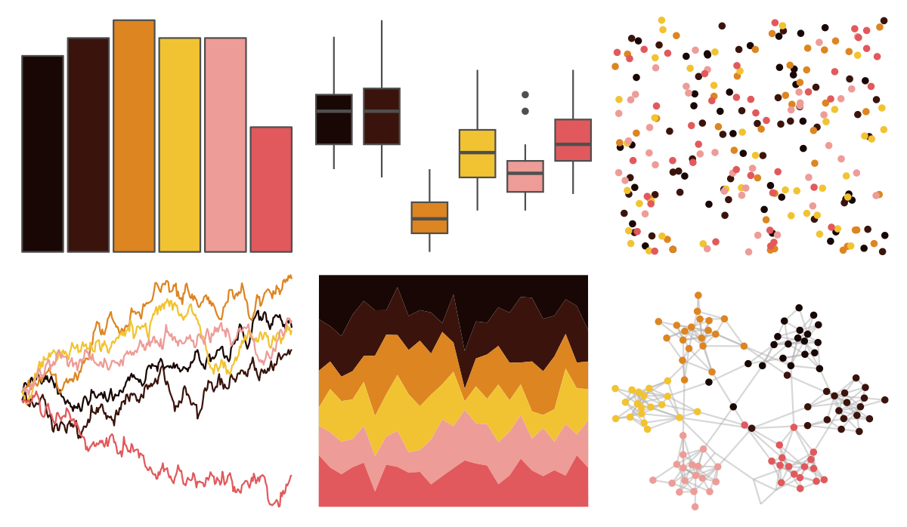

# beyonce - X36 

::: columns
::: {.column width="50%"}

**Github**

[dill/beyonce](https://github.com/dill/beyonce)
:::

::: {.column width="50%"}

**CRAN**

Not on CRAN
:::
:::

<hr> 

Use with [paletteer](https://emilhvitfeldt.github.io/paletteer/) package:

```r
library(paletteer)
paletteer_d("beyonce::X36")
```

Use raw:

```r
c("#180705FF", "#3A140CFF", "#DD8521FF", "#F1C332FF", "#ED9C97FF", "#E1595CFF")
``` 

 

<br>

# Related Palettes

<div class="list" style="display: grid; grid-template-columns: auto auto auto;"> <figure class="figure">
<a href="../../amerika/Dem_Ind_Rep3/"> </a>
</figure> <figure class="figure">
<a href="../../beyonce/X45/"> </a>
</figure> <figure class="figure">
<a href="../../MetBrewer/Greek/"> </a>
</figure> <figure class="figure">
<a href="../../wesanderson/GrandBudapest1/"> </a>
</figure> <figure class="figure">
<a href="../../MetBrewer/Tam/"> </a>
</figure> <figure class="figure">
<a href="../../DresdenColor/skingame/"> </a>
</figure> <figure class="figure">
<a href="../../soilpalettes/podzol/"> </a>
</figure> <figure class="figure">
<a href="../../MexBrewer/Naturaleza/"> </a>
</figure> <figure class="figure">
<a href="../../suffrager/london/"> </a>
</figure> <figure class="figure">
<a href="../../MexBrewer/Taurus1/"> </a>
</figure> <figure class="figure">
<a href="../../nationalparkcolors/Hawaii/"> </a>
</figure> <figure class="figure">
<a href="../../rockthemes/alice/"> </a>
</figure> 
</div>
