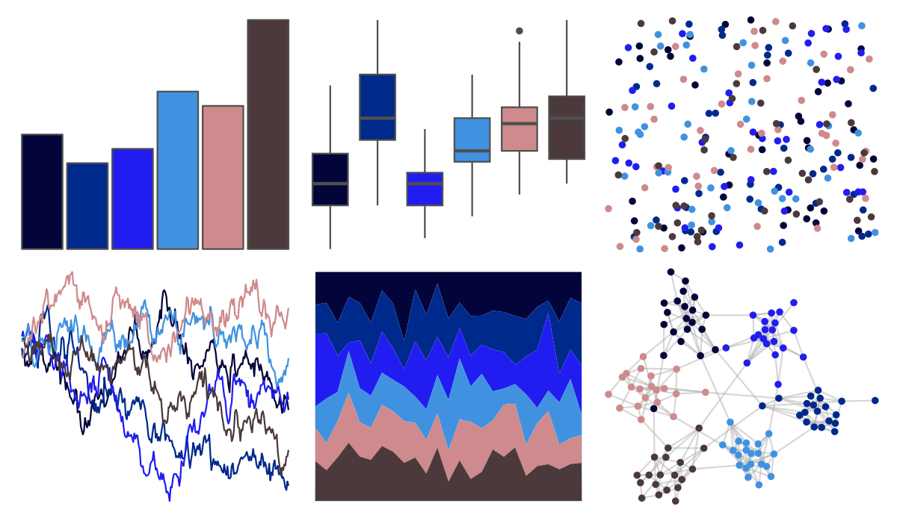

# beyonce - X37 

::: columns
::: {.column width="50%"}

**Github**

[dill/beyonce](https://github.com/dill/beyonce)
:::

::: {.column width="50%"}

**CRAN**

Not on CRAN
:::
:::

<hr> 

Use with [paletteer](https://emilhvitfeldt.github.io/paletteer/) package:

```r
library(paletteer)
paletteer_d("beyonce::X37")
```

Use raw:

```r
c("#030439FF", "#00298CFF", "#211DF0FF", "#4092E1FF", "#CE8A8CFF", "#4B393BFF")
``` 

 

<br>

# Related Palettes

<div class="list" style="display: grid; grid-template-columns: auto auto auto;"> <figure class="figure">
<a href="../../amerika/Dem_Ind_Rep3/"> </a>
</figure> <figure class="figure">
<a href="../../beyonce/X25/"> </a>
</figure> <figure class="figure">
<a href="../../nbapalettes/hornets_classic/"> </a>
</figure> <figure class="figure">
<a href="../../nbapalettes/kings_alt/"> </a>
</figure> <figure class="figure">
<a href="../../beyonce/X13/"> </a>
</figure> <figure class="figure">
<a href="../../fishualize/Acanthurus_chirurgus/"> </a>
</figure> <figure class="figure">
<a href="../../MetBrewer/Troy/"> </a>
</figure> <figure class="figure">
<a href="../../beyonce/X27/"> </a>
</figure> <figure class="figure">
<a href="../../fishualize/Clepticus_parrae/"> </a>
</figure> <figure class="figure">
<a href="../../yarrr/eternal/"> </a>
</figure> <figure class="figure">
<a href="../../ggprism/office/"> </a>
</figure> <figure class="figure">
<a href="../../beyonce/X106/"> </a>
</figure> 
</div>
