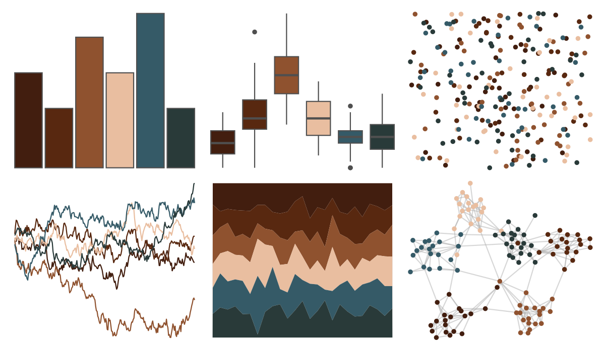

# beyonce - X38 

::: columns
::: {.column width="50%"}

**Github**

[dill/beyonce](https://github.com/dill/beyonce)
:::

::: {.column width="50%"}

**CRAN**

Not on CRAN
:::
:::

<hr> 

Use with [paletteer](https://emilhvitfeldt.github.io/paletteer/) package:

```r
library(paletteer)
paletteer_d("beyonce::X38")
```

Use raw:

```r
c("#421E0FFF", "#582810FF", "#8F522FFF", "#E9BEA0FF", "#355A67FF", "#293A39FF")
``` 

 

<br>

# Related Palettes

<div class="list" style="display: grid; grid-template-columns: auto auto auto;"> <figure class="figure">
<a href="../../amerika/Dem_Ind_Rep3/"> </a>
</figure> <figure class="figure">
<a href="../../nord/lake_superior/"> </a>
</figure> <figure class="figure">
<a href="../../nbapalettes/heat_military/"> </a>
</figure> <figure class="figure">
<a href="../../beyonce/X1/"> </a>
</figure> <figure class="figure">
<a href="../../colRoz/c_azureus/"> </a>
</figure> <figure class="figure">
<a href="../../tayloRswift/SunriseBoulevard1989/"> </a>
</figure> <figure class="figure">
<a href="../../ButterflyColors/parides_zacynthus_polymetus/"> </a>
</figure> <figure class="figure">
<a href="../../calecopal/superbloom3/"> </a>
</figure> <figure class="figure">
<a href="../../lisa/MaxBeckmann/"> </a>
</figure> <figure class="figure">
<a href="../../colRoz/capricorn/"> </a>
</figure> <figure class="figure">
<a href="../../poisonfrogs/Opsancristobal/"> </a>
</figure> <figure class="figure">
<a href="../../poisonfrogs/Etricolor/"> </a>
</figure> 
</div>
