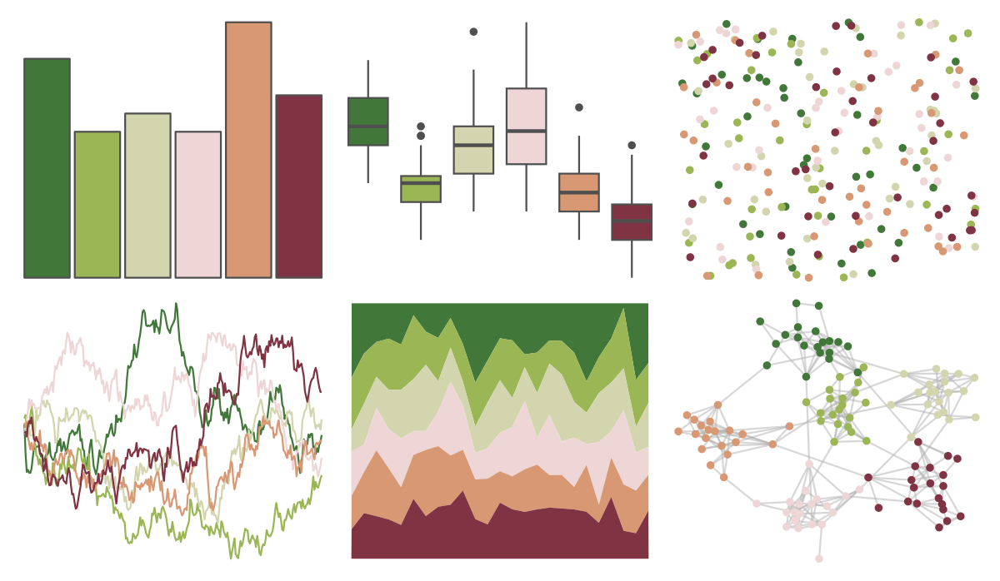

# beyonce - X39 

::: columns
::: {.column width="50%"}

**Github**

[dill/beyonce](https://github.com/dill/beyonce)
:::

::: {.column width="50%"}

**CRAN**

Not on CRAN
:::
:::

<hr> 

Use with [paletteer](https://emilhvitfeldt.github.io/paletteer/) package:

```r
library(paletteer)
paletteer_d("beyonce::X39")
```

Use raw:

```r
c("#417839FF", "#9BB655FF", "#D3D5AEFF", "#EDD6D5FF", "#D89873FF", "#803342FF")
``` 

 

<br>

# Related Palettes

<div class="list" style="display: grid; grid-template-columns: auto auto auto;"> <figure class="figure">
<a href="../../awtools/a_palette/"> </a>
</figure> <figure class="figure">
<a href="../../calecopal/arbutus/"> </a>
</figure> <figure class="figure">
<a href="../../werpals/pan/"> </a>
</figure> <figure class="figure">
<a href="../../calecopal/buow/"> </a>
</figure> <figure class="figure">
<a href="../../colRoz/ngadju/"> </a>
</figure> <figure class="figure">
<a href="../../lisa/KarlZerbe/"> </a>
</figure> <figure class="figure">
<a href="../../lisa/OttoDix_1/"> </a>
</figure> <figure class="figure">
<a href="../../fishualize/Barbus_barbus/"> </a>
</figure> <figure class="figure">
<a href="../../colRoz/p_mitchelli/"> </a>
</figure> <figure class="figure">
<a href="../../lisa/RobertDelaunay_1/"> </a>
</figure> <figure class="figure">
<a href="../../rcartocolor/Fall/"> </a>
</figure> <figure class="figure">
<a href="../../rcartocolor/Earth/"> </a>
</figure> 
</div>
