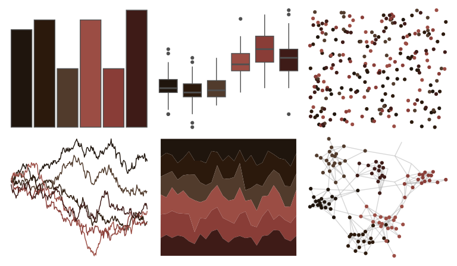

# beyonce - X4 

::: columns
::: {.column width="50%"}

**Github**

[dill/beyonce](https://github.com/dill/beyonce)
:::

::: {.column width="50%"}

**CRAN**

Not on CRAN
:::
:::

<hr> 

Use with [paletteer](https://emilhvitfeldt.github.io/paletteer/) package:

```r
library(paletteer)
paletteer_d("beyonce::X4")
```

Use raw:

```r
c("#1F150DFF", "#2B190CFF", "#513B2CFF", "#9B4D44FF", "#893D37FF", "#3E1B17FF")
``` 

 

<br>

# Related Palettes

<div class="list" style="display: grid; grid-template-columns: auto auto auto;"> <figure class="figure">
<a href="../../awtools/a_palette/"> </a>
</figure> <figure class="figure">
<a href="../../nbapalettes/blazers_city2/"> </a>
</figure> <figure class="figure">
<a href="../../ghibli/TotoroDark/"> </a>
</figure> <figure class="figure">
<a href="../../ghibli/PonyoDark/"> </a>
</figure> <figure class="figure">
<a href="../../beyonce/X20/"> </a>
</figure> <figure class="figure">
<a href="../../wesanderson/BottleRocket1/"> </a>
</figure> <figure class="figure">
<a href="../../beyonce/X8/"> </a>
</figure> <figure class="figure">
<a href="../../ghibli/MononokeDark/"> </a>
</figure> <figure class="figure">
<a href="../../beyonce/X124/"> </a>
</figure> <figure class="figure">
<a href="../../calecopal/vermillion/"> </a>
</figure> <figure class="figure">
<a href="../../beyonce/X26/"> </a>
</figure> <figure class="figure">
<a href="../../ghibli/KikiDark/"> </a>
</figure> 
</div>
