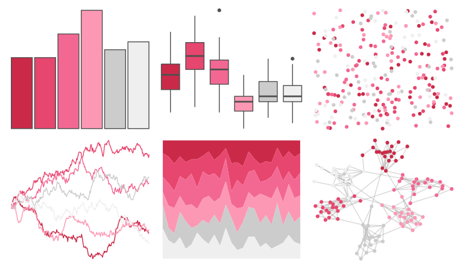
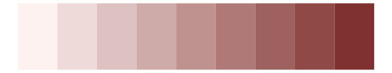
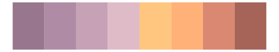

# beyonce - X44 

::: columns
::: {.column width="50%"}

**Github**

[dill/beyonce](https://github.com/dill/beyonce)
:::

::: {.column width="50%"}

**CRAN**

Not on CRAN
:::
:::

<hr> 

Use with [paletteer](https://emilhvitfeldt.github.io/paletteer/) package:

```r
library(paletteer)
paletteer_d("beyonce::X44")
```

Use raw:

```r
c("#CA2A48FF", "#E7466EFF", "#F36892FF", "#FC98B4FF", "#CCCCCCFF", "#EFEFEFFF")
``` 

 

<br>

# Related Palettes

<div class="list" style="display: grid; grid-template-columns: auto auto auto;"> <figure class="figure">
<a href="../../awtools/a_palette/"> </a>
</figure> <figure class="figure">
<a href="../../palettetown/blissey/"> </a>
</figure> <figure class="figure">
<a href="../../soilpalettes/crait/"> </a>
</figure> <figure class="figure">
<a href="../../Redmonder/sPBIRd/"> </a>
</figure> <figure class="figure">
<a href="../../ochRe/galah/"> </a>
</figure> <figure class="figure">
<a href="../../PNWColors/Spring/"> </a>
</figure> <figure class="figure">
<a href="../../rcartocolor/BurgYl/"> </a>
</figure> <figure class="figure">
<a href="../../beyonce/X92/"> </a>
</figure> <figure class="figure">
<a href="../../palettetown/corsola/"> </a>
</figure> <figure class="figure">
<a href="../../MetBrewer/Morgenstern/"> </a>
</figure> <figure class="figure">
<a href="../../lisa/JosefAlbers/"> </a>
</figure> <figure class="figure">
<a href="../../Redmonder/dPBIPuOr/"> </a>
</figure> 
</div>
