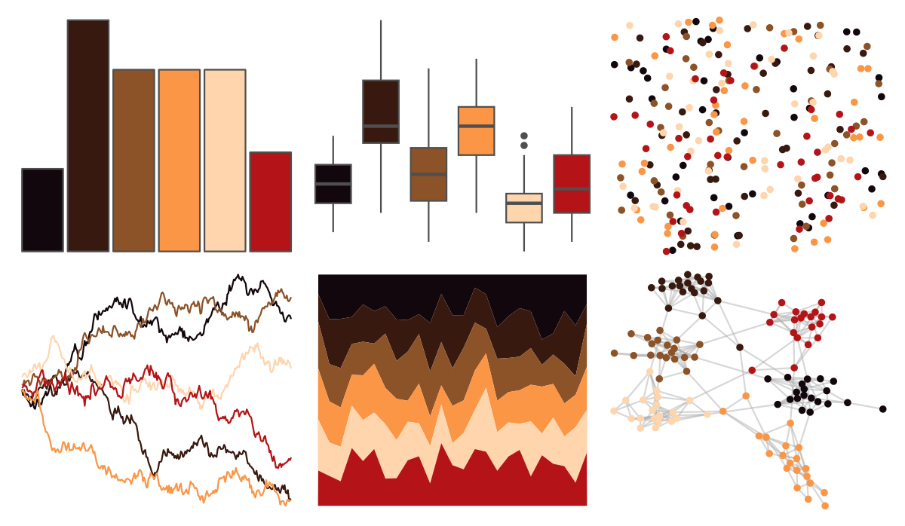

# beyonce - X45 

::: columns
::: {.column width="50%"}

**Github**

[dill/beyonce](https://github.com/dill/beyonce)
:::

::: {.column width="50%"}

**CRAN**

Not on CRAN
:::
:::

<hr> 

Use with [paletteer](https://emilhvitfeldt.github.io/paletteer/) package:

```r
library(paletteer)
paletteer_d("beyonce::X45")
```

Use raw:

```r
c("#12070DFF", "#38190FFF", "#8C5228FF", "#FA9646FF", "#FED5ACFF", "#B41417FF")
``` 

 

<br>

# Related Palettes

<div class="list" style="display: grid; grid-template-columns: auto auto auto;"> <figure class="figure">
<a href="../../amerika/Dem_Ind_Rep3/"> </a>
</figure> <figure class="figure">
<a href="../../beyonce/X36/"> </a>
</figure> <figure class="figure">
<a href="../../soilpalettes/vitrixerand/"> </a>
</figure> <figure class="figure">
<a href="../../soilpalettes/paleustalf/"> </a>
</figure> <figure class="figure">
<a href="../../MexBrewer/Naturaleza/"> </a>
</figure> <figure class="figure">
<a href="../../futurevisions/titan/"> </a>
</figure> <figure class="figure">
<a href="../../soilpalettes/podzol/"> </a>
</figure> <figure class="figure">
<a href="../../lisa/ReneMagritte/"> </a>
</figure> <figure class="figure">
<a href="../../poisonfrogs/Oanchicayensis/"> </a>
</figure> <figure class="figure">
<a href="../../nationalparkcolors/Hawaii/"> </a>
</figure> <figure class="figure">
<a href="../../rockthemes/alice/"> </a>
</figure> <figure class="figure">
<a href="../../MetBrewer/Greek/"> </a>
</figure> 
</div>
