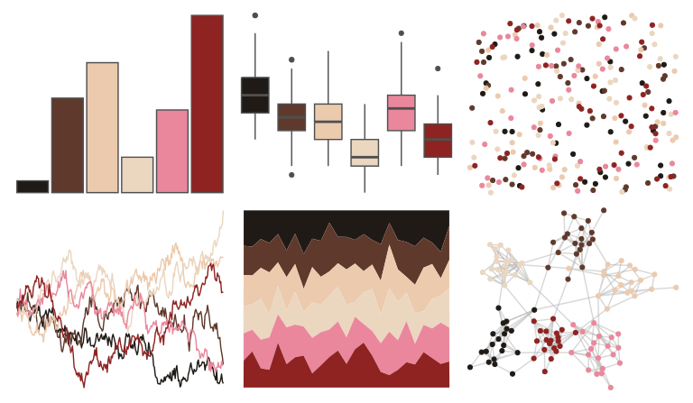

# beyonce - X46 

::: columns
::: {.column width="50%"}

**Github**

[dill/beyonce](https://github.com/dill/beyonce)
:::

::: {.column width="50%"}

**CRAN**

Not on CRAN
:::
:::

<hr> 

Use with [paletteer](https://emilhvitfeldt.github.io/paletteer/) package:

```r
library(paletteer)
paletteer_d("beyonce::X46")
```

Use raw:

```r
c("#1F1A15FF", "#5F392CFF", "#ECCAADFF", "#EBD6C0FF", "#EA879CFF", "#8E2322FF")
``` 

 

<br>

# Related Palettes

<div class="list" style="display: grid; grid-template-columns: auto auto auto;"> <figure class="figure">
<a href="../../awtools/a_palette/"> </a>
</figure> <figure class="figure">
<a href="../../soilpalettes/alaquod/"> </a>
</figure> <figure class="figure">
<a href="../../NatParksPalettes/WindCave/"> </a>
</figure> <figure class="figure">
<a href="../../fishualize/Lutjanus_sebae/"> </a>
</figure> <figure class="figure">
<a href="../../colRoz/e_kingii/"> </a>
</figure> <figure class="figure">
<a href="../../wesanderson/IsleofDogs2/"> </a>
</figure> <figure class="figure">
<a href="../../beyonce/X123/"> </a>
</figure> <figure class="figure">
<a href="../../lisa/LorserFeitelson/"> </a>
</figure> <figure class="figure">
<a href="../../rcartocolor/BrwnYl/"> </a>
</figure> <figure class="figure">
<a href="../../colRoz/picta/"> </a>
</figure> <figure class="figure">
<a href="../../fishualize/Sander_lucioperca/"> </a>
</figure> <figure class="figure">
<a href="../../lisa/AndyWarhol_2/"> </a>
</figure> 
</div>
