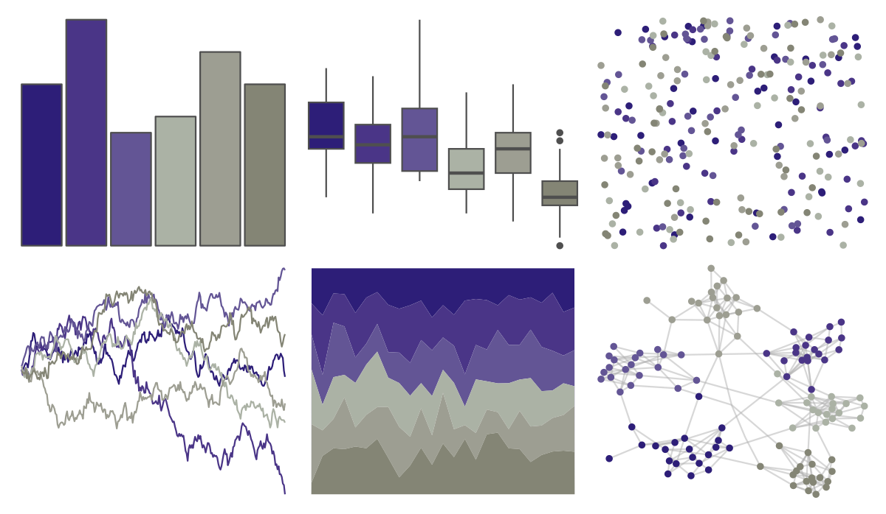

# beyonce - X47 

::: columns
::: {.column width="50%"}

**Github**

[dill/beyonce](https://github.com/dill/beyonce)
:::

::: {.column width="50%"}

**CRAN**

Not on CRAN
:::
:::

<hr> 

Use with [paletteer](https://emilhvitfeldt.github.io/paletteer/) package:

```r
library(paletteer)
paletteer_d("beyonce::X47")
```

Use raw:

```r
c("#2D1E78FF", "#4A3587FF", "#635595FF", "#ABB2A5FF", "#9D9E92FF", "#848575FF")
``` 

 

<br>

# Related Palettes

<div class="list" style="display: grid; grid-template-columns: auto auto auto;"> <figure class="figure">
<a href="../../awtools/a_palette/"> </a>
</figure> <figure class="figure">
<a href="../../colRoz/salt_lake/"> </a>
</figure> <figure class="figure">
<a href="../../musculusColors/ErHead/"> </a>
</figure> <figure class="figure">
<a href="../../nord/baie_mouton/"> </a>
</figure> <figure class="figure">
<a href="../../trekcolors/ufp/"> </a>
</figure> <figure class="figure">
<a href="../../nord/mountain_forms/"> </a>
</figure> <figure class="figure">
<a href="../../Manu/Korora/"> </a>
</figure> <figure class="figure">
<a href="../../calecopal/halfdome/"> </a>
</figure> <figure class="figure">
<a href="../../MetBrewer/VanGogh1/"> </a>
</figure> <figure class="figure">
<a href="../../impressionist.colors/la_chanson_du_chien/"> </a>
</figure> <figure class="figure">
<a href="../../tvthemes/Night/"> </a>
</figure> <figure class="figure">
<a href="../../lisa/GeorgiaOKeeffe/"> </a>
</figure> 
</div>
