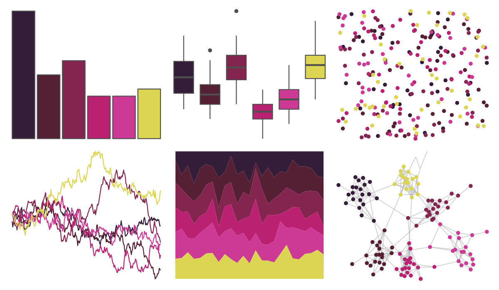

# beyonce - X48 

::: columns
::: {.column width="50%"}

**Github**

[dill/beyonce](https://github.com/dill/beyonce)
:::

::: {.column width="50%"}

**CRAN**

Not on CRAN
:::
:::

<hr> 

Use with [paletteer](https://emilhvitfeldt.github.io/paletteer/) package:

```r
library(paletteer)
paletteer_d("beyonce::X48")
```

Use raw:

```r
c("#341D39FF", "#562034FF", "#84254FFF", "#BA2271FF", "#CD3A95FF", "#DBD553FF")
``` 

 

<br>

# Related Palettes

<div class="list" style="display: grid; grid-template-columns: auto auto auto;"> <figure class="figure">
<a href="../../amerika/Dem_Ind_Rep3/"> </a>
</figure> <figure class="figure">
<a href="../../beyonce/X41/"> </a>
</figure> <figure class="figure">
<a href="../../beyonce/X30/"> </a>
</figure> <figure class="figure">
<a href="../../DresdenColor/briefcases/"> </a>
</figure> <figure class="figure">
<a href="../../beyonce/X130/"> </a>
</figure> <figure class="figure">
<a href="../../beyonce/X21/"> </a>
</figure> <figure class="figure">
<a href="../../nbapalettes/nuggets_statement/"> </a>
</figure> <figure class="figure">
<a href="../../NatParksPalettes/Volcanoes/"> </a>
</figure> <figure class="figure">
<a href="../../rockthemes/facelift/"> </a>
</figure> <figure class="figure">
<a href="../../fishualize/Cirrhilabrus_tonozukai/"> </a>
</figure> <figure class="figure">
<a href="../../rockthemes/deelite/"> </a>
</figure> <figure class="figure">
<a href="../../MetBrewer/Thomas/"> </a>
</figure> 
</div>
