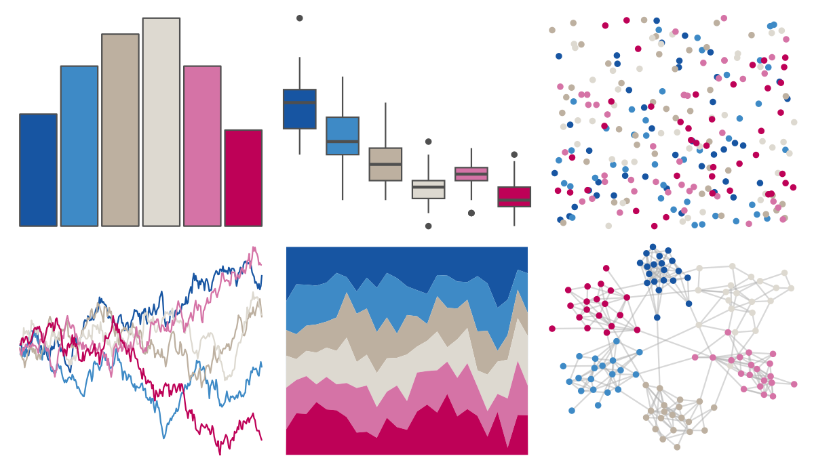

# beyonce - X49 

::: columns
::: {.column width="50%"}

**Github**

[dill/beyonce](https://github.com/dill/beyonce)
:::

::: {.column width="50%"}

**CRAN**

Not on CRAN
:::
:::

<hr> 

Use with [paletteer](https://emilhvitfeldt.github.io/paletteer/) package:

```r
library(paletteer)
paletteer_d("beyonce::X49")
```

Use raw:

```r
c("#1755A2FF", "#3E8AC6FF", "#BDB0A0FF", "#DDD9D0FF", "#D573A6FF", "#BE0157FF")
``` 

 

<br>

# Related Palettes

<div class="list" style="display: grid; grid-template-columns: auto auto auto;"> <figure class="figure">
<a href="../../awtools/a_palette/"> </a>
</figure> <figure class="figure">
<a href="../../ButterflyColors/hamadryas_feronia/"> </a>
</figure> <figure class="figure">
<a href="../../ButterflyColors/hamadryas_feronia/"> </a>
</figure> <figure class="figure">
<a href="../../feathers/galah/"> </a>
</figure> <figure class="figure">
<a href="../../ggthemes/Classic_Purple_Gray_6/"> </a>
</figure> <figure class="figure">
<a href="../../palettetown/beldum/"> </a>
</figure> <figure class="figure">
<a href="../../MapPalettes/tealberry_pie/"> </a>
</figure> <figure class="figure">
<a href="../../nbapalettes/sixers_city/"> </a>
</figure> <figure class="figure">
<a href="../../beyonce/X11/"> </a>
</figure> <figure class="figure">
<a href="../../palettetown/nidoranm/"> </a>
</figure> <figure class="figure">
<a href="../../ltc/ploen/"> </a>
</figure> <figure class="figure">
<a href="../../tvthemes/SmokyQuartz/"> </a>
</figure> 
</div>
