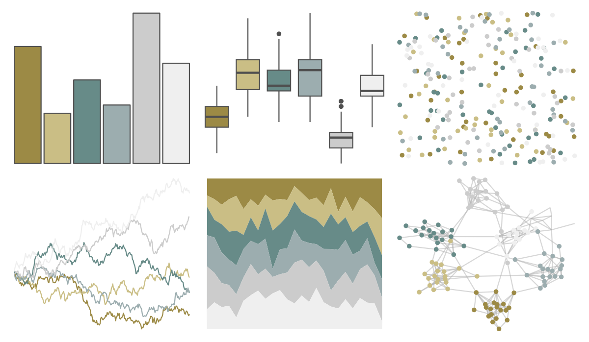

# beyonce - X5 

::: columns
::: {.column width="50%"}

**Github**

[dill/beyonce](https://github.com/dill/beyonce)
:::

::: {.column width="50%"}

**CRAN**

Not on CRAN
:::
:::

<hr> 

Use with [paletteer](https://emilhvitfeldt.github.io/paletteer/) package:

```r
library(paletteer)
paletteer_d("beyonce::X5")
```

Use raw:

```r
c("#9C8A45FF", "#CABE85FF", "#678B88FF", "#9CADAFFF", "#CCCCCCFF", "#EFEFEFFF")
``` 

 

<br>

# Related Palettes

<div class="list" style="display: grid; grid-template-columns: auto auto auto;"> <figure class="figure">
<a href="../../awtools/a_palette/"> </a>
</figure> <figure class="figure">
<a href="../../fishualize/Ginglymostoma_cirratum/"> </a>
</figure> <figure class="figure">
<a href="../../ghibli/TotoroLight/"> </a>
</figure> <figure class="figure">
<a href="../../ghibli/KikiLight/"> </a>
</figure> <figure class="figure">
<a href="../../calecopal/chaparral2/"> </a>
</figure> <figure class="figure">
<a href="../../ghibli/MarnieLight1/"> </a>
</figure> <figure class="figure">
<a href="../../beyonce/X50/"> </a>
</figure> <figure class="figure">
<a href="../../musculusColors/ErFluke/"> </a>
</figure> <figure class="figure">
<a href="../../rcartocolor/Earth/"> </a>
</figure> <figure class="figure">
<a href="../../lisa/PaulKlee/"> </a>
</figure> <figure class="figure">
<a href="../../fishualize/Oncorhynchus_tshawytscha/"> </a>
</figure> <figure class="figure">
<a href="../../fishualize/Atherinella_brasiliensis/"> </a>
</figure> 
</div>
