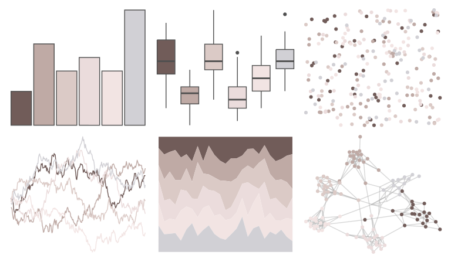

# beyonce - X50 

::: columns
::: {.column width="50%"}

**Github**

[dill/beyonce](https://github.com/dill/beyonce)
:::

::: {.column width="50%"}

**CRAN**

Not on CRAN
:::
:::

<hr> 

Use with [paletteer](https://emilhvitfeldt.github.io/paletteer/) package:

```r
library(paletteer)
paletteer_d("beyonce::X50")
```

Use raw:

```r
c("#715C59FF", "#BFAAA5FF", "#DBCAC6FF", "#EBDCDCFF", "#F2E4E3FF", "#D1D0D5FF")
``` 

 

<br>

# Related Palettes

<div class="list" style="display: grid; grid-template-columns: auto auto auto;"> <figure class="figure">
<a href="../../awtools/a_palette/"> </a>
</figure> <figure class="figure">
<a href="../../palettetown/onix/"> </a>
</figure> <figure class="figure">
<a href="../../musculusColors/ErFluke/"> </a>
</figure> <figure class="figure">
<a href="../../fishualize/Atherinella_brasiliensis/"> </a>
</figure> <figure class="figure">
<a href="../../ghibli/KikiLight/"> </a>
</figure> <figure class="figure">
<a href="../../fishualize/Mugil_liza/"> </a>
</figure> <figure class="figure">
<a href="../../ghibli/TotoroLight/"> </a>
</figure> <figure class="figure">
<a href="../../fishualize/Anchoviella_lepidentostole/"> </a>
</figure> <figure class="figure">
<a href="../../fishualize/Ginglymostoma_cirratum/"> </a>
</figure> <figure class="figure">
<a href="../../ghibli/SpiritedLight/"> </a>
</figure> <figure class="figure">
<a href="../../beyonce/X5/"> </a>
</figure> <figure class="figure">
<a href="../../lisa/AlbrechtDurer/"> </a>
</figure> 
</div>
