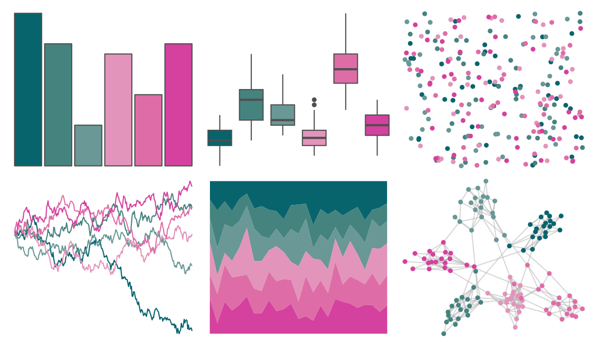

# beyonce - X51 

::: columns
::: {.column width="50%"}

**Github**

[dill/beyonce](https://github.com/dill/beyonce)
:::

::: {.column width="50%"}

**CRAN**

Not on CRAN
:::
:::

<hr> 

Use with [paletteer](https://emilhvitfeldt.github.io/paletteer/) package:

```r
library(paletteer)
paletteer_d("beyonce::X51")
```

Use raw:

```r
c("#07646DFF", "#45837FFF", "#699896FF", "#E394BBFF", "#DE6DA7FF", "#D4419EFF")
``` 

 

<br>

# Related Palettes

<div class="list" style="display: grid; grid-template-columns: auto auto auto;"> <figure class="figure">
<a href="../../amerika/Dem_Ind_Rep3/"> </a>
</figure> <figure class="figure">
<a href="../../MapPalettes/tealberry_pie/"> </a>
</figure> <figure class="figure">
<a href="../../LaCroixColoR/Berry/"> </a>
</figure> <figure class="figure">
<a href="../../ggthemes/excel_Gallery/"> </a>
</figure> <figure class="figure">
<a href="../../unikn/pal_unikn_dark/"> </a>
</figure> <figure class="figure">
<a href="../../nbapalettes/hornets_city2/"> </a>
</figure> <figure class="figure">
<a href="../../Redmonder/qMSORdPu/"> </a>
</figure> <figure class="figure">
<a href="../../fishualize/Sparisoma_tuyupiranga_m/"> </a>
</figure> <figure class="figure">
<a href="../../beyonce/X49/"> </a>
</figure> <figure class="figure">
<a href="../../fishualize/Scarus_globiceps/"> </a>
</figure> <figure class="figure">
<a href="../../nbapalettes/hornets2/"> </a>
</figure> <figure class="figure">
<a href="../../beyonce/X108/"> </a>
</figure> 
</div>
