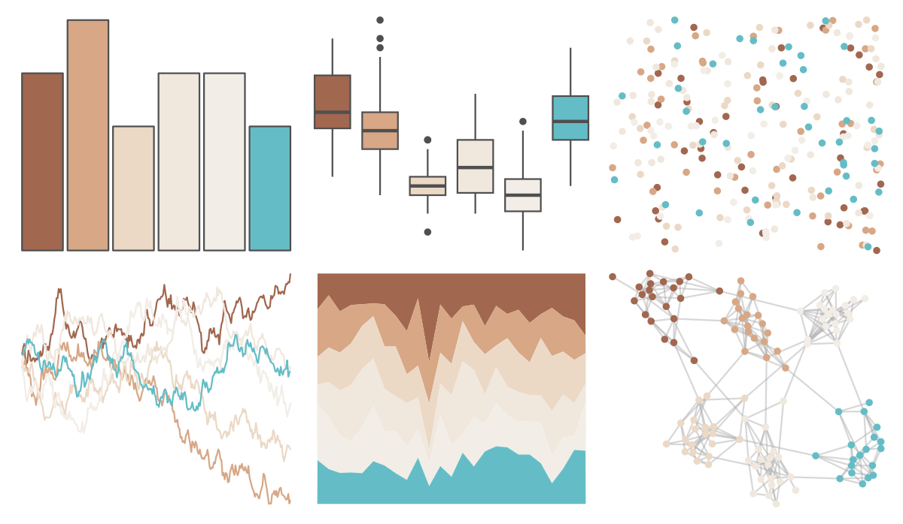

# beyonce - X52 

::: columns
::: {.column width="50%"}

**Github**

[dill/beyonce](https://github.com/dill/beyonce)
:::

::: {.column width="50%"}

**CRAN**

Not on CRAN
:::
:::

<hr> 

Use with [paletteer](https://emilhvitfeldt.github.io/paletteer/) package:

```r
library(paletteer)
paletteer_d("beyonce::X52")
```

Use raw:

```r
c("#A1674FFF", "#D7A786FF", "#EBD9C6FF", "#F0E7DDFF", "#F2EDE6FF", "#64BDC6FF")
``` 

 

<br>

# Related Palettes

<div class="list" style="display: grid; grid-template-columns: auto auto auto;"> <figure class="figure">
<a href="../../amerika/Dem_Ind_Rep3/"> </a>
</figure> <figure class="figure">
<a href="../../lisa/AlbrechtDurer/"> </a>
</figure> <figure class="figure">
<a href="../../calecopal/chaparral2/"> </a>
</figure> <figure class="figure">
<a href="../../fishualize/Anchoviella_lepidentostole/"> </a>
</figure> <figure class="figure">
<a href="../../nationalparkcolors/BryceCanyon/"> </a>
</figure> <figure class="figure">
<a href="../../fishualize/Lycengraulis_grossidens/"> </a>
</figure> <figure class="figure">
<a href="../../Redmonder/sPBIOr/"> </a>
</figure> <figure class="figure">
<a href="../../ghibli/KikiLight/"> </a>
</figure> <figure class="figure">
<a href="../../ghibli/MarnieLight1/"> </a>
</figure> <figure class="figure">
<a href="../../beyonce/X35/"> </a>
</figure> <figure class="figure">
<a href="../../beyonce/X50/"> </a>
</figure> <figure class="figure">
<a href="../../ghibli/PonyoLight/"> </a>
</figure> 
</div>
