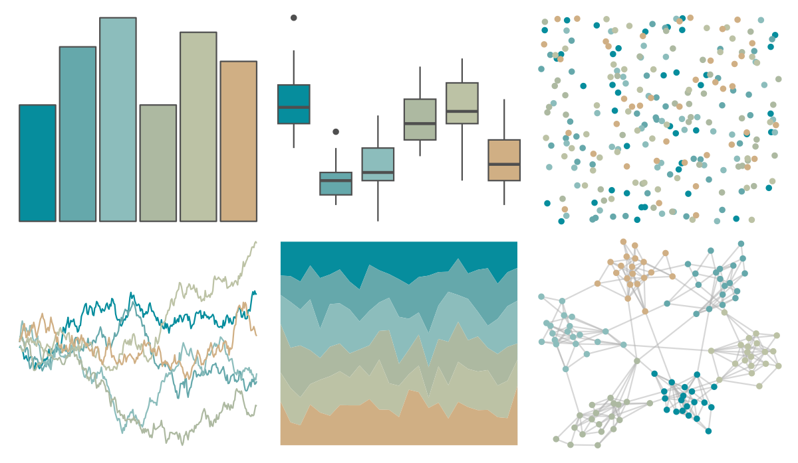

# beyonce - X54 

::: columns
::: {.column width="50%"}

**Github**

[dill/beyonce](https://github.com/dill/beyonce)
:::

::: {.column width="50%"}

**CRAN**

Not on CRAN
:::
:::

<hr> 

Use with [paletteer](https://emilhvitfeldt.github.io/paletteer/) package:

```r
library(paletteer)
paletteer_d("beyonce::X54")
```

Use raw:

```r
c("#068D9DFF", "#65A8ABFF", "#8CBDBCFF", "#ADB9A1FF", "#BCC2A5FF", "#D0AF84FF")
``` 

 

<br>

# Related Palettes

<div class="list" style="display: grid; grid-template-columns: auto auto auto;"> <figure class="figure">
<a href="../../awtools/a_palette/"> </a>
</figure> <figure class="figure">
<a href="../../beyonce/X35/"> </a>
</figure> <figure class="figure">
<a href="../../fishualize/Cetengraulis_edentulus/"> </a>
</figure> <figure class="figure">
<a href="../../IslamicArt/konya/"> </a>
</figure> <figure class="figure">
<a href="../../rcartocolor/Earth/"> </a>
</figure> <figure class="figure">
<a href="../../fishualize/Sardinella_brasiliensis/"> </a>
</figure> <figure class="figure">
<a href="../../nationalparkcolors/MtRainier/"> </a>
</figure> <figure class="figure">
<a href="../../ggthemes/excel_Feathered/"> </a>
</figure> <figure class="figure">
<a href="../../wesanderson/Chevalier1/"> </a>
</figure> <figure class="figure">
<a href="../../ggthemes/excel_Crop/"> </a>
</figure> <figure class="figure">
<a href="../../lisa/PaulKlee/"> </a>
</figure> <figure class="figure">
<a href="../../calecopal/chaparral2/"> </a>
</figure> 
</div>
