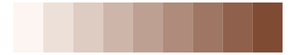
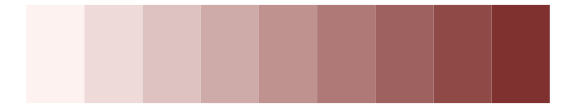

# beyonce - X55 

::: columns
::: {.column width="50%"}

**Github**

[dill/beyonce](https://github.com/dill/beyonce)
:::

::: {.column width="50%"}

**CRAN**

Not on CRAN
:::
:::

<hr> 

Use with [paletteer](https://emilhvitfeldt.github.io/paletteer/) package:

```r
library(paletteer)
paletteer_d("beyonce::X55")
```

Use raw:

```r
c("#5C4746FF", "#7F6B61FF", "#836F65FF", "#C2B0A3FF", "#D9C6B8FF", "#F4EBE2FF", "#FFF8F5FF")
``` 

 

<br>

# Related Palettes

<div class="list" style="display: grid; grid-template-columns: auto auto auto;"> <figure class="figure">
<a href="../../awtools/a_palette/"> </a>
</figure> <figure class="figure">
<a href="../../Redmonder/sPBIOr/"> </a>
</figure> <figure class="figure">
<a href="../../Redmonder/sPBIRd/"> </a>
</figure> <figure class="figure">
<a href="../../palettetown/kabutops/"> </a>
</figure> <figure class="figure">
<a href="../../rcartocolor/TealRose/"> </a>
</figure> <figure class="figure">
<a href="../../palettetown/rhydon/"> </a>
</figure> <figure class="figure">
<a href="../../trekcolors/iconian/"> </a>
</figure> <figure class="figure">
<a href="../../beyonce/X9/"> </a>
</figure> <figure class="figure">
<a href="../../beyonce/X129/"> </a>
</figure> <figure class="figure">
<a href="../../PNWColors/Shuksan/"> </a>
</figure> <figure class="figure">
<a href="../../nationalparkcolors/MtRainier/"> </a>
</figure> <figure class="figure">
<a href="../../ggpomological/pomological_base/"> </a>
</figure> 
</div>
