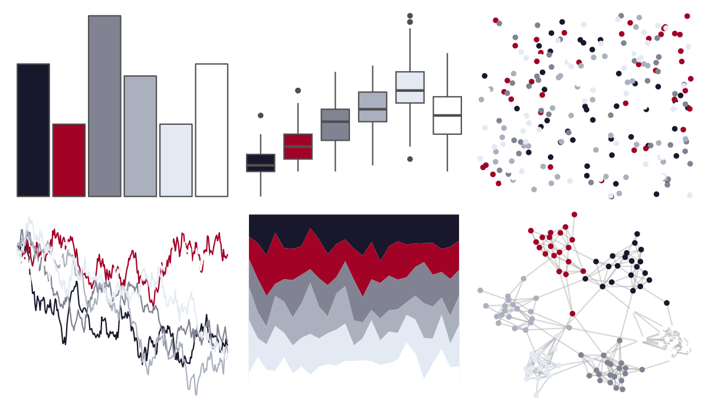

# beyonce - X56 

::: columns
::: {.column width="50%"}

**Github**

[dill/beyonce](https://github.com/dill/beyonce)
:::

::: {.column width="50%"}

**CRAN**

Not on CRAN
:::
:::

<hr> 

Use with [paletteer](https://emilhvitfeldt.github.io/paletteer/) package:

```r
library(paletteer)
paletteer_d("beyonce::X56")
```

Use raw:

```r
c("#19172CFF", "#A20226FF", "#818392FF", "#AAB0BEFF", "#E3EAF4FF", "#FFFFFFFF")
``` 

 

<br>

# Related Palettes

<div class="list" style="display: grid; grid-template-columns: auto auto auto;"> <figure class="figure">
<a href="../../awtools/a_palette/"> </a>
</figure> <figure class="figure">
<a href="../../palettetown/rhyhorn/"> </a>
</figure> <figure class="figure">
<a href="../../beyonce/X92/"> </a>
</figure> <figure class="figure">
<a href="../../ghibli/SpiritedMedium/"> </a>
</figure> <figure class="figure">
<a href="../../PNWColors/Shuksan/"> </a>
</figure> <figure class="figure">
<a href="../../beyonce/X128/"> </a>
</figure> <figure class="figure">
<a href="../../palettetown/aerodactyl/"> </a>
</figure> <figure class="figure">
<a href="../../nbapalettes/wizards_earned/"> </a>
</figure> <figure class="figure">
<a href="../../palettetown/cascoon/"> </a>
</figure> <figure class="figure">
<a href="../../tvthemes/Spinel/"> </a>
</figure> <figure class="figure">
<a href="../../beyonce/X11/"> </a>
</figure> <figure class="figure">
<a href="../../palettetown/tangela/"> </a>
</figure> 
</div>
