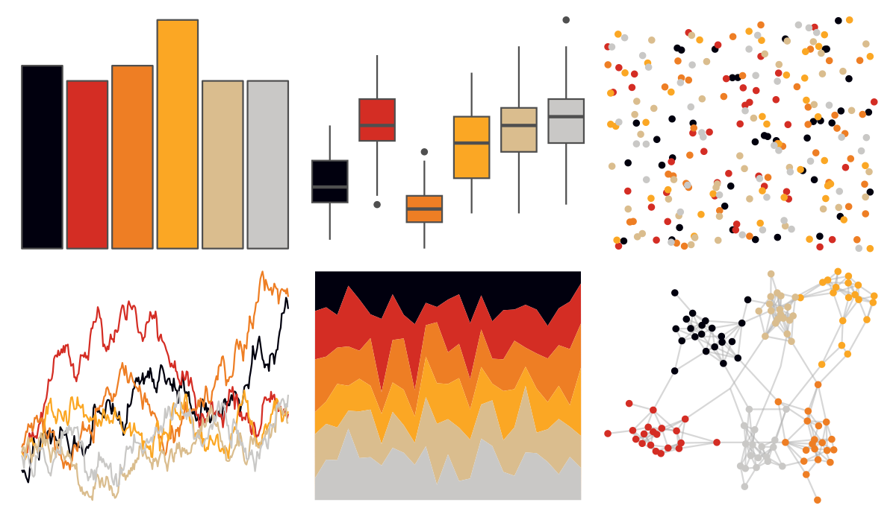

# beyonce - X58 

::: columns
::: {.column width="50%"}

**Github**

[dill/beyonce](https://github.com/dill/beyonce)
:::

::: {.column width="50%"}

**CRAN**

Not on CRAN
:::
:::

<hr> 

Use with [paletteer](https://emilhvitfeldt.github.io/paletteer/) package:

```r
library(paletteer)
paletteer_d("beyonce::X58")
```

Use raw:

```r
c("#01000EFF", "#D42D24FF", "#EE7E24FF", "#FBA724FF", "#DABD8EFF", "#C9C8C6FF")
``` 

 

<br>

# Related Palettes

<div class="list" style="display: grid; grid-template-columns: auto auto auto;"> <figure class="figure">
<a href="../../awtools/a_palette/"> </a>
</figure> <figure class="figure">
<a href="../../colRoz/l_vestiens/"> </a>
</figure> <figure class="figure">
<a href="../../lisa/SandroBotticelli_1/"> </a>
</figure> <figure class="figure">
<a href="../../lisa/ReneMagritte/"> </a>
</figure> <figure class="figure">
<a href="../../DresdenColor/skingame/"> </a>
</figure> <figure class="figure">
<a href="../../Redmonder/qMSOYl/"> </a>
</figure> <figure class="figure">
<a href="../../colRoz/ngadju/"> </a>
</figure> <figure class="figure">
<a href="../../trekcolors/breen2/"> </a>
</figure> <figure class="figure">
<a href="../../colRoz/flavolineata/"> </a>
</figure> <figure class="figure">
<a href="../../soilpalettes/paleustalf/"> </a>
</figure> <figure class="figure">
<a href="../../trekcolors/tholian/"> </a>
</figure> <figure class="figure">
<a href="../../soilpalettes/podzol/"> </a>
</figure> 
</div>
