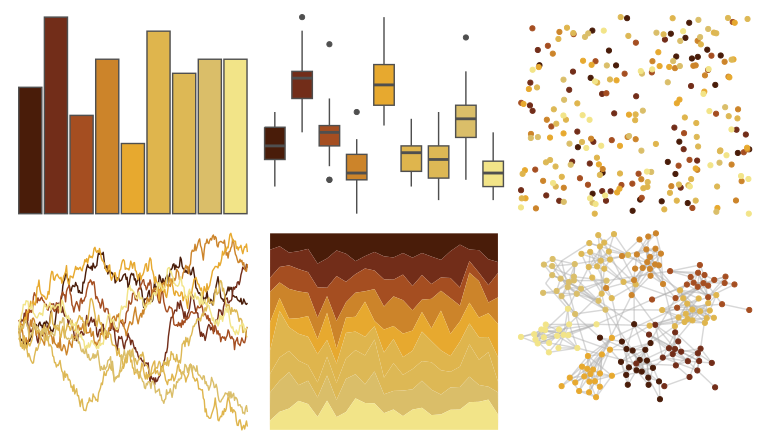

# beyonce - X59 

::: columns
::: {.column width="50%"}

**Github**

[dill/beyonce](https://github.com/dill/beyonce)
:::

::: {.column width="50%"}

**CRAN**

Not on CRAN
:::
:::

<hr> 

Use with [paletteer](https://emilhvitfeldt.github.io/paletteer/) package:

```r
library(paletteer)
paletteer_d("beyonce::X59")
```

Use raw:

```r
c("#491C09FF", "#722D19FF", "#A54E21FF", "#CC842AFF", "#E7A92FFF", "#DFB54DFF", "#DDB855FF", "#DABE69FF", "#F2E488FF")
``` 

 

<br>

# Related Palettes

<div class="list" style="display: grid; grid-template-columns: auto auto auto;"> <figure class="figure">
<a href="../../awtools/a_palette/"> </a>
</figure> <figure class="figure">
<a href="../../beyonce/X86/"> </a>
</figure> <figure class="figure">
<a href="../../palettetown/swinub/"> </a>
</figure> <figure class="figure">
<a href="../../colRoz/a_westwoodi/"> </a>
</figure> <figure class="figure">
<a href="../../soilpalettes/natrudoll/"> </a>
</figure> <figure class="figure">
<a href="../../colRoz/a_plagiata/"> </a>
</figure> <figure class="figure">
<a href="../../werpals/halong/"> </a>
</figure> <figure class="figure">
<a href="../../khroma/YlOrBr/"> </a>
</figure> <figure class="figure">
<a href="../../MetBrewer/Homer2/"> </a>
</figure> <figure class="figure">
<a href="../../RColorBrewer/YlOrBr/"> </a>
</figure> <figure class="figure">
<a href="../../palettetown/staryu/"> </a>
</figure> <figure class="figure">
<a href="../../tayloRswift/fearless/"> </a>
</figure> 
</div>
