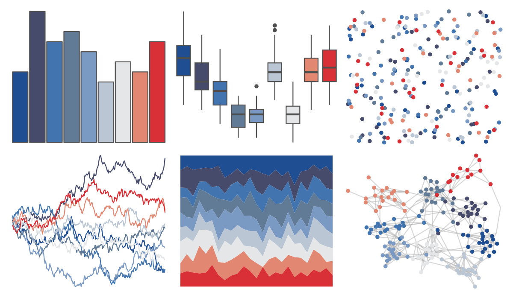

# beyonce - X60 

::: columns
::: {.column width="50%"}

**Github**

[dill/beyonce](https://github.com/dill/beyonce)
:::

::: {.column width="50%"}

**CRAN**

Not on CRAN
:::
:::

<hr> 

Use with [paletteer](https://emilhvitfeldt.github.io/paletteer/) package:

```r
library(paletteer)
paletteer_d("beyonce::X60")
```

Use raw:

```r
c("#1F4E93FF", "#464A6BFF", "#4275AFFF", "#617B97FF", "#7A99C3FF", "#BBC6D4FF", "#E5E6E8FF", "#E28772FF", "#D83036FF")
``` 

 

<br>

# Related Palettes

<div class="list" style="display: grid; grid-template-columns: auto auto auto;"> <figure class="figure">
<a href="../../awtools/a_palette/"> </a>
</figure> <figure class="figure">
<a href="../../palettetown/metang/"> </a>
</figure> <figure class="figure">
<a href="../../palettetown/beldum/"> </a>
</figure> <figure class="figure">
<a href="../../palettetown/articuno/"> </a>
</figure> <figure class="figure">
<a href="../../palettetown/metagross/"> </a>
</figure> <figure class="figure">
<a href="../../palettetown/nidoranf/"> </a>
</figure> <figure class="figure">
<a href="../../palettetown/steelix/"> </a>
</figure> <figure class="figure">
<a href="../../palettetown/tangela/"> </a>
</figure> <figure class="figure">
<a href="../../palettetown/latios/"> </a>
</figure> <figure class="figure">
<a href="../../palettetown/nidorina/"> </a>
</figure> <figure class="figure">
<a href="../../MetBrewer/Cassatt1/"> </a>
</figure> <figure class="figure">
<a href="../../palettetown/pupitar/"> </a>
</figure> 
</div>
