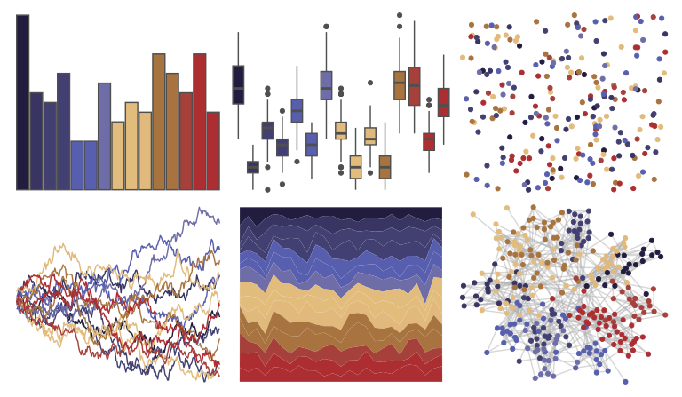

# beyonce - X61 

::: columns
::: {.column width="50%"}

**Github**

[dill/beyonce](https://github.com/dill/beyonce)
:::

::: {.column width="50%"}

**CRAN**

Not on CRAN
:::
:::

<hr> 

Use with [paletteer](https://emilhvitfeldt.github.io/paletteer/) package:

```r
library(paletteer)
paletteer_d("beyonce::X61")
```

Use raw:

```r
c("#221C3EFF", "#383562FF", "#424071FF", "#424072FF", "#575EAEFF", "#585FAFFF", "#6E6DA7FF", "#E2BC7DFF", "#E2BC7BFF", "#E1B97CFF", "#A7743FFF", "#A8733FFF", "#A6403BFF", "#AC2E31FF", "#AC2E32FF")
``` 

 

<br>

# Related Palettes

<div class="list" style="display: grid; grid-template-columns: auto auto auto;"> <figure class="figure">
<a href="../../awtools/a_palette/"> </a>
</figure> <figure class="figure">
<a href="../../impressionist.colors/te_aa_no_areois/"> </a>
</figure> <figure class="figure">
<a href="../../beyonce/X76/"> </a>
</figure> <figure class="figure">
<a href="../../MetBrewer/Redon/"> </a>
</figure> <figure class="figure">
<a href="../../impressionist.colors/fleurs_dans_un_vase_de_cristal/"> </a>
</figure> <figure class="figure">
<a href="../../impressionist.colors/la_chanson_du_chien/"> </a>
</figure> <figure class="figure">
<a href="../../MetBrewer/Demuth/"> </a>
</figure> <figure class="figure">
<a href="../../MetBrewer/Renoir/"> </a>
</figure> <figure class="figure">
<a href="../../ochRe/emu_woman_paired/"> </a>
</figure> <figure class="figure">
<a href="../../impressionist.colors/les_peupliers/"> </a>
</figure> <figure class="figure">
<a href="../../impressionist.colors/les_nympheas/"> </a>
</figure> <figure class="figure">
<a href="../../MetBrewer/Manet/"> </a>
</figure> 
</div>
