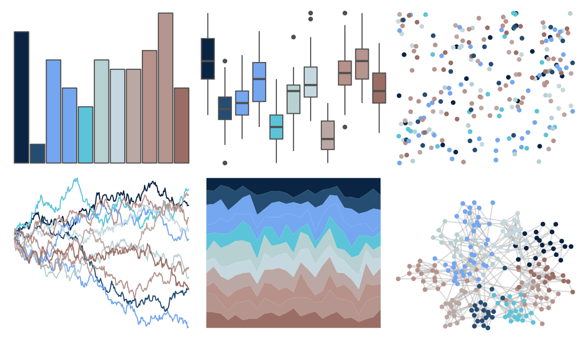

# beyonce - X63 

::: columns
::: {.column width="50%"}

**Github**

[dill/beyonce](https://github.com/dill/beyonce)
:::

::: {.column width="50%"}

**CRAN**

Not on CRAN
:::
:::

<hr> 

Use with [paletteer](https://emilhvitfeldt.github.io/paletteer/) package:

```r
library(paletteer)
paletteer_d("beyonce::X63")
```

Use raw:

```r
c("#0A2443FF", "#254D72FF", "#75A6F0FF", "#74A7EFFF", "#5BC4D9FF", "#B7D0D2FF", "#C5D8DFFF", "#BBA7A3FF", "#B7928AFF", "#B5958EFF", "#9B6E65FF")
``` 

 

<br>

# Related Palettes

<div class="list" style="display: grid; grid-template-columns: auto auto auto;"> <figure class="figure">
<a href="../../awtools/a_palette/"> </a>
</figure> <figure class="figure">
<a href="../../ButterflyColors/hamadryas_feronia/"> </a>
</figure> <figure class="figure">
<a href="../../ButterflyColors/hamadryas_feronia/"> </a>
</figure> <figure class="figure">
<a href="../../palettetown/metagross/"> </a>
</figure> <figure class="figure">
<a href="../../palettetown/metang/"> </a>
</figure> <figure class="figure">
<a href="../../palettetown/mantine/"> </a>
</figure> <figure class="figure">
<a href="../../palettetown/articuno/"> </a>
</figure> <figure class="figure">
<a href="../../ggthemes/hc_fg/"> </a>
</figure> <figure class="figure">
<a href="../../palettetown/nidoranf/"> </a>
</figure> <figure class="figure">
<a href="../../unikn/pal_unikn_pair/"> </a>
</figure> <figure class="figure">
<a href="../../palettetown/nidorina/"> </a>
</figure> <figure class="figure">
<a href="../../palettetown/tangela/"> </a>
</figure> 
</div>
