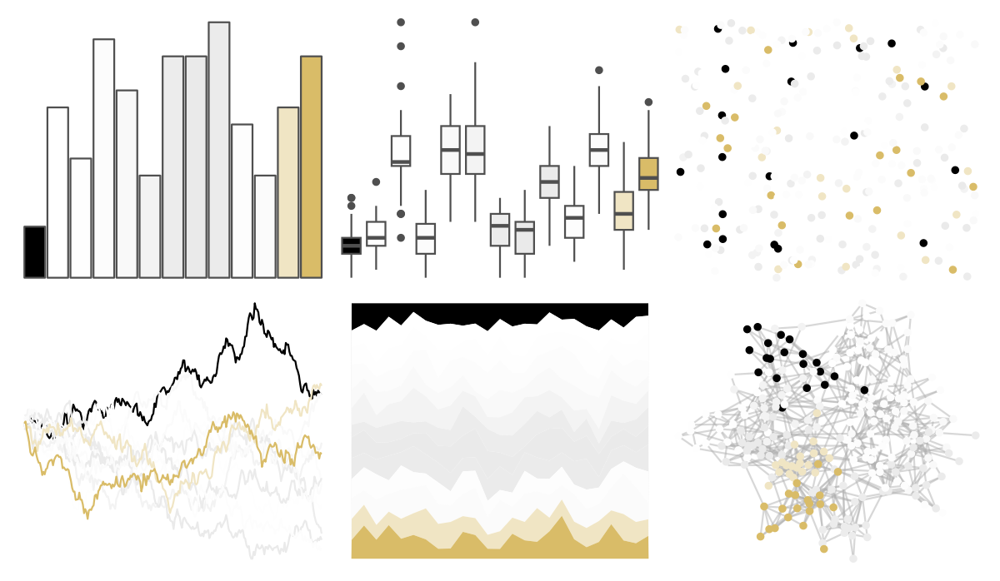

# beyonce - X65 

::: columns
::: {.column width="50%"}

**Github**

[dill/beyonce](https://github.com/dill/beyonce)
:::

::: {.column width="50%"}

**CRAN**

Not on CRAN
:::
:::

<hr> 

Use with [paletteer](https://emilhvitfeldt.github.io/paletteer/) package:

```r
library(paletteer)
paletteer_d("beyonce::X65")
```

Use raw:

```r
c("#000000FF", "#FFFFFFFF", "#FEFEFEFF", "#FCFCFCFF", "#F9F9F9FF", "#F3F3F3FF", "#ECECECFF", "#EAEAEAFF", "#EBEBEBFF", "#FDFDFDFF", "#FBFBFBFF", "#F0E5C4FF", "#D9BC68FF")
``` 

 

<br>

# Related Palettes

<div class="list" style="display: grid; grid-template-columns: auto auto auto;"> <figure class="figure">
<a href="../../amerika/Dem_Ind_Rep3/"> </a>
</figure> <figure class="figure">
<a href="../../beyonce/X87/"> </a>
</figure> <figure class="figure">
<a href="../../palettetown/vibrava/"> </a>
</figure> <figure class="figure">
<a href="../../palettetown/pinsir/"> </a>
</figure> <figure class="figure">
<a href="../../palettetown/kabutops/"> </a>
</figure> <figure class="figure">
<a href="../../palettetown/medicham/"> </a>
</figure> <figure class="figure">
<a href="../../palettetown/hitmonlee/"> </a>
</figure> <figure class="figure">
<a href="../../ggthemr/chalk/"> </a>
</figure> <figure class="figure">
<a href="../../palettetown/cubone/"> </a>
</figure> <figure class="figure">
<a href="../../ggsci/grey_material/"> </a>
</figure> <figure class="figure">
<a href="../../calecopal/coastaldune1/"> </a>
</figure> <figure class="figure">
<a href="../../impressionist.colors/melon_et_peches/"> </a>
</figure> 
</div>
