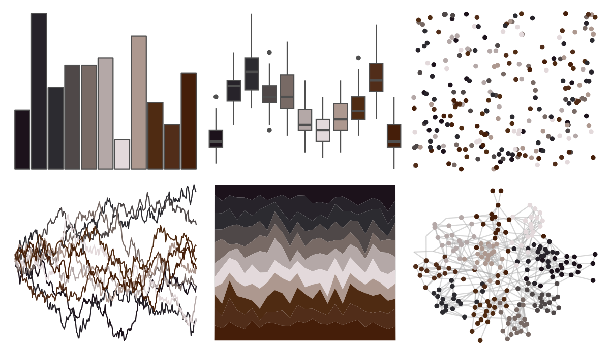

# beyonce - X67 

::: columns
::: {.column width="50%"}

**Github**

[dill/beyonce](https://github.com/dill/beyonce)
:::

::: {.column width="50%"}

**CRAN**

Not on CRAN
:::
:::

<hr> 

Use with [paletteer](https://emilhvitfeldt.github.io/paletteer/) package:

```r
library(paletteer)
paletteer_d("beyonce::X67")
```

Use raw:

```r
c("#1C121BFF", "#27232AFF", "#2C2B30FF", "#4F4848FF", "#786A65FF", "#B4A8A7FF", "#E3D9DBFF", "#AD988FFF", "#4F2B12FF", "#512D19FF", "#451E09FF")
``` 

 

<br>

# Related Palettes

<div class="list" style="display: grid; grid-template-columns: auto auto auto;"> <figure class="figure">
<a href="../../awtools/a_palette/"> </a>
</figure> <figure class="figure">
<a href="../../beyonce/X100/"> </a>
</figure> <figure class="figure">
<a href="../../beyonce/X85/"> </a>
</figure> <figure class="figure">
<a href="../../colRoz/kimberley/"> </a>
</figure> <figure class="figure">
<a href="../../beyonce/X81/"> </a>
</figure> <figure class="figure">
<a href="../../peRReo/don/"> </a>
</figure> <figure class="figure">
<a href="../../beyonce/X57/"> </a>
</figure> <figure class="figure">
<a href="../../colRoz/p_breviceps/"> </a>
</figure> <figure class="figure">
<a href="../../beyonce/X46/"> </a>
</figure> <figure class="figure">
<a href="../../ghibli/SpiritedMedium/"> </a>
</figure> <figure class="figure">
<a href="../../ghibli/KikiMedium/"> </a>
</figure> <figure class="figure">
<a href="../../colRoz/e_kingii/"> </a>
</figure> 
</div>
