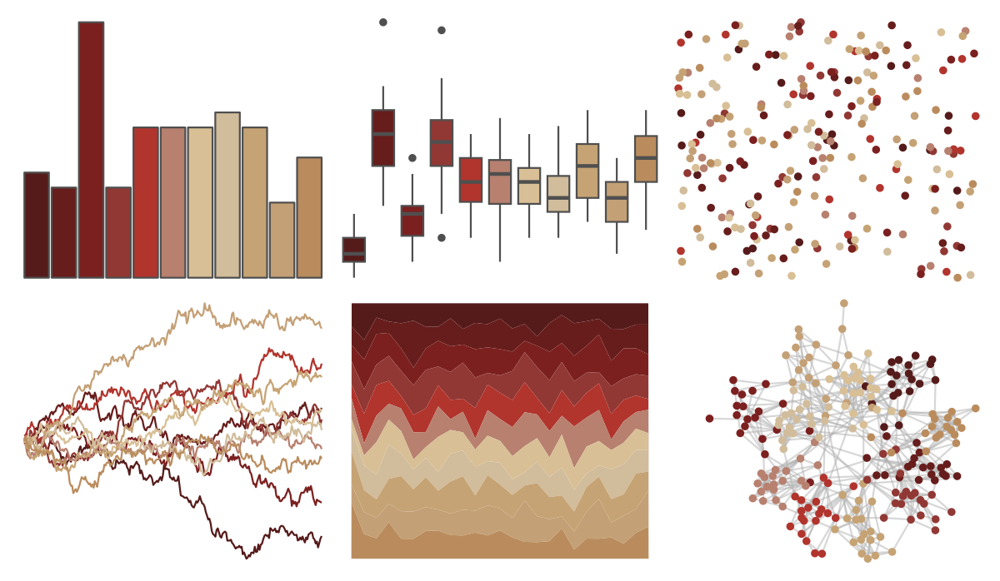
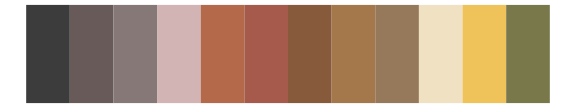
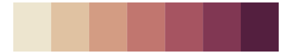

# beyonce - X69 

::: columns
::: {.column width="50%"}

**Github**

[dill/beyonce](https://github.com/dill/beyonce)
:::

::: {.column width="50%"}

**CRAN**

Not on CRAN
:::
:::

<hr> 

Use with [paletteer](https://emilhvitfeldt.github.io/paletteer/) package:

```r
library(paletteer)
paletteer_d("beyonce::X69")
```

Use raw:

```r
c("#551B1AFF", "#661D1CFF", "#7B201FFF", "#913834FF", "#B1342DFF", "#B7806FFF", "#D8BF95FF", "#D1BC9BFF", "#C6A374FF", "#C4A076FF", "#BA8C5DFF")
``` 

 

<br>

# Related Palettes

<div class="list" style="display: grid; grid-template-columns: auto auto auto;"> <figure class="figure">
<a href="../../awtools/a_palette/"> </a>
</figure> <figure class="figure">
<a href="../../lisa/BarnettNewman/"> </a>
</figure> <figure class="figure">
<a href="../../palettetown/spinda/"> </a>
</figure> <figure class="figure">
<a href="../../palettetown/lunatone/"> </a>
</figure> <figure class="figure">
<a href="../../werpals/firefly/"> </a>
</figure> <figure class="figure">
<a href="../../trekcolors/iconian/"> </a>
</figure> <figure class="figure">
<a href="../../impressionist.colors/chanteuse_de_cafe_concert/"> </a>
</figure> <figure class="figure">
<a href="../../feathers/oriole/"> </a>
</figure> <figure class="figure">
<a href="../../fishualize/Epinephelus_striatus/"> </a>
</figure> <figure class="figure">
<a href="../../beyonce/X81/"> </a>
</figure> <figure class="figure">
<a href="../../rcartocolor/BrwnYl/"> </a>
</figure> <figure class="figure">
<a href="../../impressionist.colors/paysage_tropical_avec_masureset_palmiers/"> </a>
</figure> 
</div>
