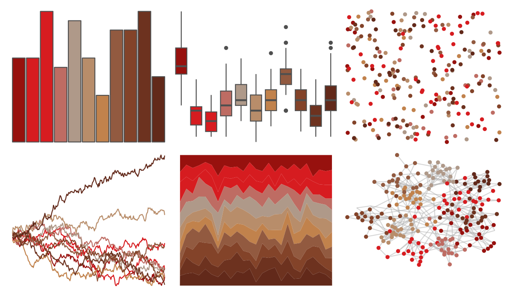

# beyonce - X70 

::: columns
::: {.column width="50%"}

**Github**

[dill/beyonce](https://github.com/dill/beyonce)
:::

::: {.column width="50%"}

**CRAN**

Not on CRAN
:::
:::

<hr> 

Use with [paletteer](https://emilhvitfeldt.github.io/paletteer/) package:

```r
library(paletteer)
paletteer_d("beyonce::X70")
```

Use raw:

```r
c("#97110EFF", "#D61C20FF", "#D71C20FF", "#BE6C63FF", "#AF9989FF", "#B88D6AFF", "#C1824CFF", "#925A40FF", "#834329FF", "#6D321FFF", "#62291AFF")
``` 

 

<br>

# Related Palettes

<div class="list" style="display: grid; grid-template-columns: auto auto auto;"> <figure class="figure">
<a href="../../awtools/a_palette/"> </a>
</figure> <figure class="figure">
<a href="../../ButterflyColors/hamadryas_feronia/"> </a>
</figure> <figure class="figure">
<a href="../../ButterflyColors/hamadryas_feronia/"> </a>
</figure> <figure class="figure">
<a href="../../ButterflyColors/catagramma_pygas/"> </a>
</figure> <figure class="figure">
<a href="../../miscpalettes/chocolate/"> </a>
</figure> <figure class="figure">
<a href="../../NatParksPalettes/BryceCanyon/"> </a>
</figure> <figure class="figure">
<a href="../../ggthemes/excel_Wood_Type/"> </a>
</figure> <figure class="figure">
<a href="../../ggthemes/excel_Orange_Red/"> </a>
</figure> <figure class="figure">
<a href="../../beyonce/X113/"> </a>
</figure> <figure class="figure">
<a href="../../ButterflyColors/historis_acheronta/"> </a>
</figure> <figure class="figure">
<a href="../../werpals/firefly/"> </a>
</figure> <figure class="figure">
<a href="../../fishualize/Labrisomus_cricota/"> </a>
</figure> 
</div>
