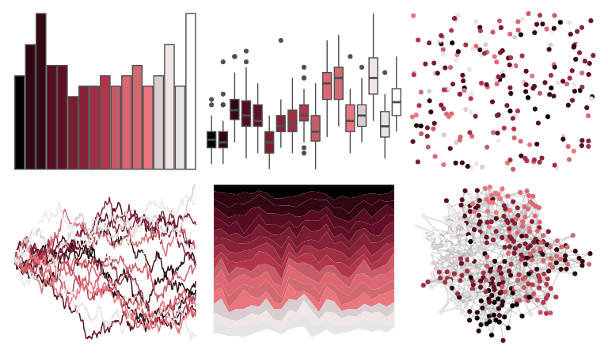

# beyonce - X71 

::: columns
::: {.column width="50%"}

**Github**

[dill/beyonce](https://github.com/dill/beyonce)
:::

::: {.column width="50%"}

**CRAN**

Not on CRAN
:::
:::

<hr> 

Use with [paletteer](https://emilhvitfeldt.github.io/paletteer/) package:

```r
library(paletteer)
paletteer_d("beyonce::X71")
```

Use raw:

```r
c("#000000FF", "#2E0711FF", "#330813FF", "#570D21FF", "#610F25FF", "#781E31FF", "#862137FF", "#9F3043FF", "#B1364BFF", "#C65C66FF", "#DC6772FF", "#D16970FF", "#E9757DFF", "#D8CECFFF", "#F1E5E6FF", "#E5E5E5FF", "#FFFFFFFF")
``` 

 

<br>

# Related Palettes

<div class="list" style="display: grid; grid-template-columns: auto auto auto;"> <figure class="figure">
<a href="../../awtools/a_palette/"> </a>
</figure> <figure class="figure">
<a href="../../beyonce/X67/"> </a>
</figure> <figure class="figure">
<a href="../../beyonce/X118/"> </a>
</figure> <figure class="figure">
<a href="../../palettetown/grumpig/"> </a>
</figure> <figure class="figure">
<a href="../../palettetown/sableye/"> </a>
</figure> <figure class="figure">
<a href="../../beyonce/X100/"> </a>
</figure> <figure class="figure">
<a href="../../palettetown/meditite/"> </a>
</figure> <figure class="figure">
<a href="../../beyonce/X76/"> </a>
</figure> <figure class="figure">
<a href="../../palettetown/mightyena/"> </a>
</figure> <figure class="figure">
<a href="../../tvthemes/Sardonyx/"> </a>
</figure> <figure class="figure">
<a href="../../palettetown/carvanha/"> </a>
</figure> <figure class="figure">
<a href="../../palettetown/zangoose/"> </a>
</figure> 
</div>
