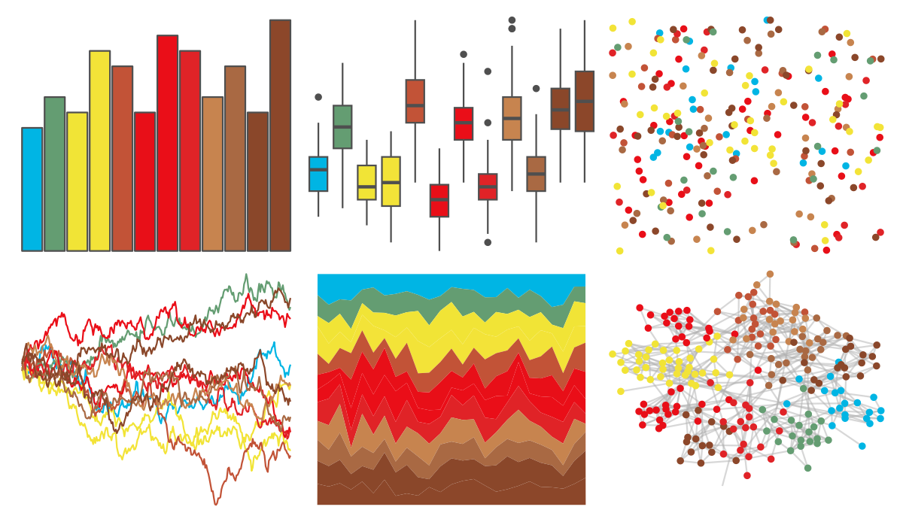

# beyonce - X72 

::: columns
::: {.column width="50%"}

**Github**

[dill/beyonce](https://github.com/dill/beyonce)
:::

::: {.column width="50%"}

**CRAN**

Not on CRAN
:::
:::

<hr> 

Use with [paletteer](https://emilhvitfeldt.github.io/paletteer/) package:

```r
library(paletteer)
paletteer_d("beyonce::X72")
```

Use raw:

```r
c("#00B5E4FF", "#649D72FF", "#F1E436FF", "#F3E338FF", "#C25337FF", "#E80F18FF", "#EA0E18FF", "#E02327FF", "#C7844FFF", "#A96943FF", "#8A472AFF", "#8C472AFF")
``` 

 

<br>

# Related Palettes

<div class="list" style="display: grid; grid-template-columns: auto auto auto;"> <figure class="figure">
<a href="../../awtools/a_palette/"> </a>
</figure> <figure class="figure">
<a href="../../ButterflyColors/hamadryas_feronia/"> </a>
</figure> <figure class="figure">
<a href="../../ButterflyColors/hamadryas_feronia/"> </a>
</figure> <figure class="figure">
<a href="../../palettetown/parasect/"> </a>
</figure> <figure class="figure">
<a href="../../palettetown/magcargo/"> </a>
</figure> <figure class="figure">
<a href="../../MetBrewer/Paquin/"> </a>
</figure> <figure class="figure">
<a href="../../palettetown/slowpoke/"> </a>
</figure> <figure class="figure">
<a href="../../palettetown/lunatone/"> </a>
</figure> <figure class="figure">
<a href="../../ggprism/beer_and_ales/"> </a>
</figure> <figure class="figure">
<a href="../../tvthemes/parksAndRec/"> </a>
</figure> <figure class="figure">
<a href="../../Redmonder/qMSOYl/"> </a>
</figure> <figure class="figure">
<a href="../../Redmonder/qMSORdOr/"> </a>
</figure> 
</div>
