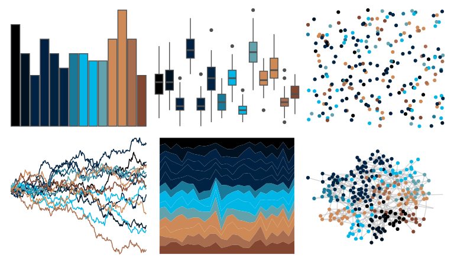

# beyonce - X73 

::: columns
::: {.column width="50%"}

**Github**

[dill/beyonce](https://github.com/dill/beyonce)
:::

::: {.column width="50%"}

**CRAN**

Not on CRAN
:::
:::

<hr> 

Use with [paletteer](https://emilhvitfeldt.github.io/paletteer/) package:

```r
library(paletteer)
paletteer_d("beyonce::X73")
```

Use raw:

```r
c("#000000FF", "#001221FF", "#012243FF", "#002142FF", "#002341FF", "#002343FF", "#187999FF", "#00B6E6FF", "#00B6E5FF", "#62A2ACFF", "#CD8958FF", "#CD8A56FF", "#A86D4FFF", "#834631FF")
``` 

 

<br>

# Related Palettes

<div class="list" style="display: grid; grid-template-columns: auto auto auto;"> <figure class="figure">
<a href="../../awtools/a_palette/"> </a>
</figure> <figure class="figure">
<a href="../../MetBrewer/Troy/"> </a>
</figure> <figure class="figure">
<a href="../../ggprism/muted_rainbow/"> </a>
</figure> <figure class="figure">
<a href="../../beyonce/X94/"> </a>
</figure> <figure class="figure">
<a href="../../impressionist.colors/te_aa_no_areois/"> </a>
</figure> <figure class="figure">
<a href="../../ggthemr/fresh/"> </a>
</figure> <figure class="figure">
<a href="../../nbapalettes/bobcats/"> </a>
</figure> <figure class="figure">
<a href="../../MetBrewer/Moreau/"> </a>
</figure> <figure class="figure">
<a href="../../MetBrewer/Veronese/"> </a>
</figure> <figure class="figure">
<a href="../../ghibli/KikiMedium/"> </a>
</figure> <figure class="figure">
<a href="../../beyonce/X64/"> </a>
</figure> <figure class="figure">
<a href="../../beyonce/X83/"> </a>
</figure> 
</div>
