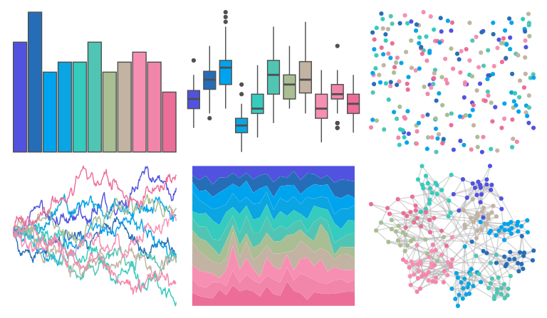

# beyonce - X74 

::: columns
::: {.column width="50%"}

**Github**

[dill/beyonce](https://github.com/dill/beyonce)
:::

::: {.column width="50%"}

**CRAN**

Not on CRAN
:::
:::

<hr> 

Use with [paletteer](https://emilhvitfeldt.github.io/paletteer/) package:

```r
library(paletteer)
paletteer_d("beyonce::X74")
```

Use raw:

```r
c("#5152E0FF", "#266DB8FF", "#00A4EEFF", "#0AA5E2FF", "#35CBBFFF", "#51C5B4FF", "#A9BE93FF", "#C2B3A2FF", "#F78FB2FF", "#F186AAFF", "#EC6D98FF")
``` 

 

<br>

# Related Palettes

<div class="list" style="display: grid; grid-template-columns: auto auto auto;"> <figure class="figure">
<a href="../../awtools/a_palette/"> </a>
</figure> <figure class="figure">
<a href="../../unikn/pal_unikn_pair/"> </a>
</figure> <figure class="figure">
<a href="../../trekcolors/lcars_nemesis/"> </a>
</figure> <figure class="figure">
<a href="../../trekcolors/lcars_29c/"> </a>
</figure> <figure class="figure">
<a href="../../Redmonder/dPBIRdBu/"> </a>
</figure> <figure class="figure">
<a href="../../calecopal/figmtn/"> </a>
</figure> <figure class="figure">
<a href="../../beyonce/X63/"> </a>
</figure> <figure class="figure">
<a href="../../palettetown/nidoranf/"> </a>
</figure> <figure class="figure">
<a href="../../beyonce/X49/"> </a>
</figure> <figure class="figure">
<a href="../../ggthemes/hc_fg/"> </a>
</figure> <figure class="figure">
<a href="../../palettetown/metagross/"> </a>
</figure> <figure class="figure">
<a href="../../yarrr/pony/"> </a>
</figure> 
</div>
