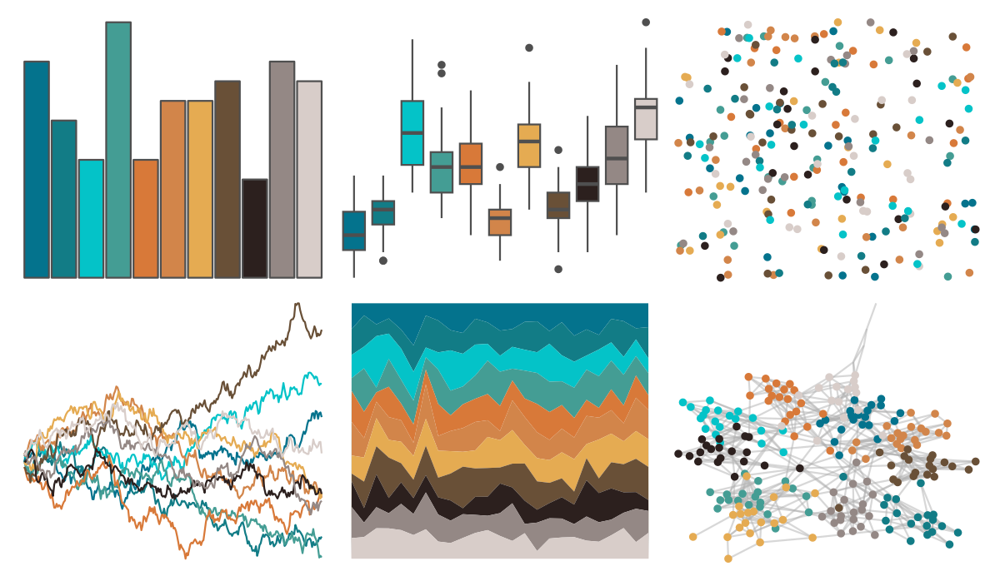

# beyonce - X75 

::: columns
::: {.column width="50%"}

**Github**

[dill/beyonce](https://github.com/dill/beyonce)
:::

::: {.column width="50%"}

**CRAN**

Not on CRAN
:::
:::

<hr> 

Use with [paletteer](https://emilhvitfeldt.github.io/paletteer/) package:

```r
library(paletteer)
paletteer_d("beyonce::X75")
```

Use raw:

```r
c("#04738DFF", "#127C86FF", "#04C3C8FF", "#449D94FF", "#D87939FF", "#D2854AFF", "#E5AB52FF", "#695037FF", "#2C201EFF", "#948885FF", "#D8CDC9FF")
``` 

 

<br>

# Related Palettes

<div class="list" style="display: grid; grid-template-columns: auto auto auto;"> <figure class="figure">
<a href="../../awtools/a_palette/"> </a>
</figure> <figure class="figure">
<a href="../../miscpalettes/dreaming/"> </a>
</figure> <figure class="figure">
<a href="../../dutchmasters/milkmaid/"> </a>
</figure> <figure class="figure">
<a href="../../werpals/bryce/"> </a>
</figure> <figure class="figure">
<a href="../../ggthemes/hc_fg/"> </a>
</figure> <figure class="figure">
<a href="../../werpals/jozi/"> </a>
</figure> <figure class="figure">
<a href="../../palettetown/totodile/"> </a>
</figure> <figure class="figure">
<a href="../../ggsci/nrc_npg/"> </a>
</figure> <figure class="figure">
<a href="../../ggthemes/Classic_Color_Blind/"> </a>
</figure> <figure class="figure">
<a href="../../ochRe/olsen_seq/"> </a>
</figure> <figure class="figure">
<a href="../../ggthemr/light/"> </a>
</figure> <figure class="figure">
<a href="../../ggsci/light_uchicago/"> </a>
</figure> 
</div>
