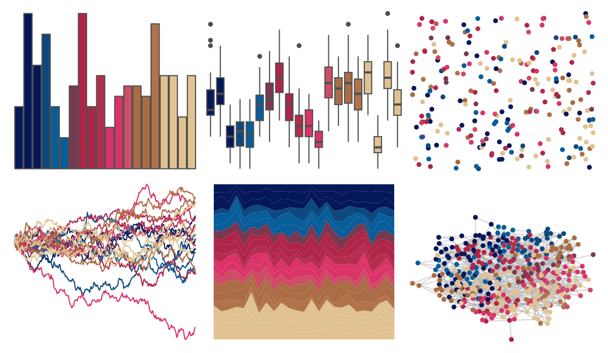

# beyonce - X76 

::: columns
::: {.column width="50%"}

**Github**

[dill/beyonce](https://github.com/dill/beyonce)
:::

::: {.column width="50%"}

**CRAN**

Not on CRAN
:::
:::

<hr> 

Use with [paletteer](https://emilhvitfeldt.github.io/paletteer/) package:

```r
library(paletteer)
paletteer_d("beyonce::X76")
```

Use raw:

```r
c("#05185AFF", "#041759FF", "#04175BFF", "#0D497DFF", "#075D9AFF", "#085C9AFF", "#783850FF", "#AF2547FF", "#AF2549FF", "#B32D4EFF", "#DB3367FF", "#DA3367FF", "#CE4C66FF", "#AA6C45FF", "#AA6C43FF", "#B1734AFF", "#E0C290FF", "#E2C293FF", "#E2C291FF", "#E1C391FF")
``` 

 

<br>

# Related Palettes

<div class="list" style="display: grid; grid-template-columns: auto auto auto;"> <figure class="figure">
<a href="../../amerika/Dem_Ind_Rep3/"> </a>
</figure> <figure class="figure">
<a href="../../beyonce/X61/"> </a>
</figure> <figure class="figure">
<a href="../../beyonce/X94/"> </a>
</figure> <figure class="figure">
<a href="../../MetBrewer/Renoir/"> </a>
</figure> <figure class="figure">
<a href="../../beyonce/X99/"> </a>
</figure> <figure class="figure">
<a href="../../beyonce/X71/"> </a>
</figure> <figure class="figure">
<a href="../../impressionist.colors/te_aa_no_areois/"> </a>
</figure> <figure class="figure">
<a href="../../nbapalettes/suns_city/"> </a>
</figure> <figure class="figure">
<a href="../../MetBrewer/Redon/"> </a>
</figure> <figure class="figure">
<a href="../../ggsci/category20b_d3/"> </a>
</figure> <figure class="figure">
<a href="../../ochRe/emu_woman_paired/"> </a>
</figure> <figure class="figure">
<a href="../../MetBrewer/Signac/"> </a>
</figure> 
</div>
