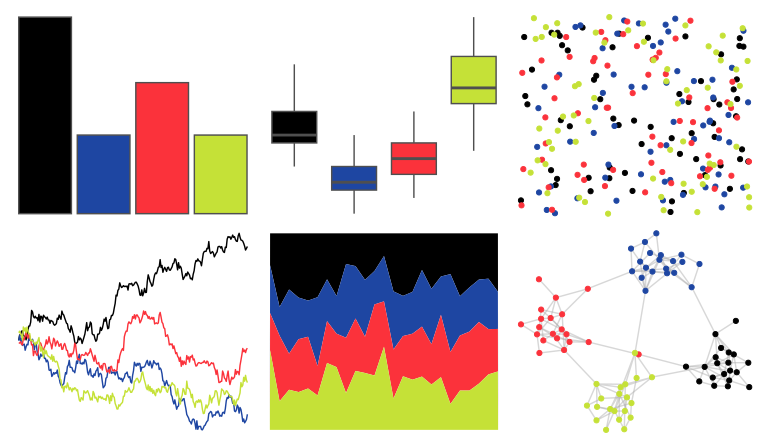

# beyonce - X78 

::: columns
::: {.column width="50%"}

**Github**

[dill/beyonce](https://github.com/dill/beyonce)
:::

::: {.column width="50%"}

**CRAN**

Not on CRAN
:::
:::

<hr> 

Use with [paletteer](https://emilhvitfeldt.github.io/paletteer/) package:

```r
library(paletteer)
paletteer_d("beyonce::X78")
```

Use raw:

```r
c("#000000FF", "#1E46A2FF", "#FB323BFF", "#C5E137FF")
``` 

 

<br>

# Related Palettes

<div class="list" style="display: grid; grid-template-columns: auto auto auto;"> <figure class="figure">
<a href="../../awtools/a_palette/"> </a>
</figure> <figure class="figure">
<a href="../../nbapalettes/nuggets_city2/"> </a>
</figure> <figure class="figure">
<a href="../../nbapalettes/timberwolves_classic/"> </a>
</figure> <figure class="figure">
<a href="../../nbapalettes/nets_city/"> </a>
</figure> <figure class="figure">
<a href="../../lisa/KazimirMalevich/"> </a>
</figure> <figure class="figure">
<a href="../../lisa/LeeKrasner/"> </a>
</figure> <figure class="figure">
<a href="../../trekcolors/bajoran/"> </a>
</figure> <figure class="figure">
<a href="../../ggthemes/few_Dark/"> </a>
</figure> <figure class="figure">
<a href="../../NatParksPalettes/Volcanoes/"> </a>
</figure> <figure class="figure">
<a href="../../Manu/Kakariki/"> </a>
</figure> <figure class="figure">
<a href="../../fishualize/Zebrasoma_velifer/"> </a>
</figure> <figure class="figure">
<a href="../../ggprism/inferno/"> </a>
</figure> 
</div>
