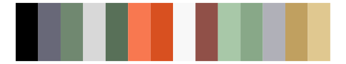

# beyonce - X79 

::: columns
::: {.column width="50%"}

**Github**

[dill/beyonce](https://github.com/dill/beyonce)
:::

::: {.column width="50%"}

**CRAN**

Not on CRAN
:::
:::

<hr> 

Use with [paletteer](https://emilhvitfeldt.github.io/paletteer/) package:

```r
library(paletteer)
paletteer_d("beyonce::X79")
```

Use raw:

```r
c("#000000FF", "#045456FF", "#079FA3FF", "#677773FF", "#E75742FF", "#CF7660FF", "#C6AA73FF", "#CCB587FF", "#F0D69FFF", "#E8CEA9FF", "#E2C8B2FF")
``` 

 

<br>

# Related Palettes

<div class="list" style="display: grid; grid-template-columns: auto auto auto;"> <figure class="figure">
<a href="../../awtools/a_palette/"> </a>
</figure> <figure class="figure">
<a href="../../palettetown/umbreon/"> </a>
</figure> <figure class="figure">
<a href="../../palettetown/houndoom/"> </a>
</figure> <figure class="figure">
<a href="../../palettetown/medicham/"> </a>
</figure> <figure class="figure">
<a href="../../trekcolors/tholian/"> </a>
</figure> <figure class="figure">
<a href="../../palettetown/houndour/"> </a>
</figure> <figure class="figure">
<a href="../../palettetown/anorith/"> </a>
</figure> <figure class="figure">
<a href="../../palettetown/beedrill/"> </a>
</figure> <figure class="figure">
<a href="../../palettetown/weedle/"> </a>
</figure> <figure class="figure">
<a href="../../palettetown/duskull/"> </a>
</figure> <figure class="figure">
<a href="../../palettetown/slakoth/"> </a>
</figure> <figure class="figure">
<a href="../../palettetown/poochyena/"> </a>
</figure> 
</div>
