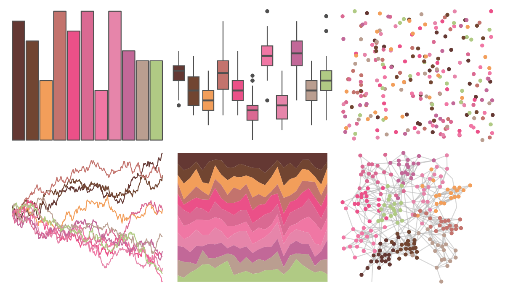

# beyonce - X80 

::: columns
::: {.column width="50%"}

**Github**

[dill/beyonce](https://github.com/dill/beyonce)
:::

::: {.column width="50%"}

**CRAN**

Not on CRAN
:::
:::

<hr> 

Use with [paletteer](https://emilhvitfeldt.github.io/paletteer/) package:

```r
library(paletteer)
paletteer_d("beyonce::X80")
```

Use raw:

```r
c("#643833FF", "#714531FF", "#F29E5AFF", "#C3736DFF", "#EB5088FF", "#DA6992FF", "#F077A4FF", "#E685AAFF", "#C26898FF", "#BA9E90FF", "#B0CA84FF")
``` 

 

<br>

# Related Palettes

<div class="list" style="display: grid; grid-template-columns: auto auto auto;"> <figure class="figure">
<a href="../../amerika/Dem_Ind_Rep3/"> </a>
</figure> <figure class="figure">
<a href="../../rcartocolor/BurgYl/"> </a>
</figure> <figure class="figure">
<a href="../../trekcolors/lcars_first_contact/"> </a>
</figure> <figure class="figure">
<a href="../../Redmonder/dPBIPuOr/"> </a>
</figure> <figure class="figure">
<a href="../../palettetown/tyrogue/"> </a>
</figure> <figure class="figure">
<a href="../../PNWColors/Sunset/"> </a>
</figure> <figure class="figure">
<a href="../../trekcolors/lcars_2369/"> </a>
</figure> <figure class="figure">
<a href="../../palettetown/gengar/"> </a>
</figure> <figure class="figure">
<a href="../../colRoz/c_brevi/"> </a>
</figure> <figure class="figure">
<a href="../../rcartocolor/BrwnYl/"> </a>
</figure> <figure class="figure">
<a href="../../PrettyCols/Summer/"> </a>
</figure> <figure class="figure">
<a href="../../palettetown/shellder/"> </a>
</figure> 
</div>
