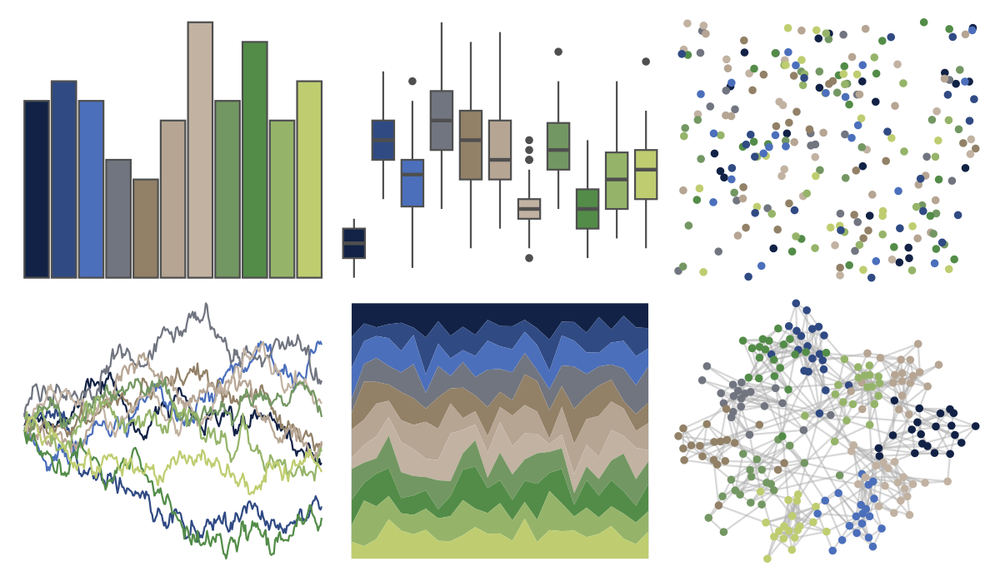

# beyonce - X82 

::: columns
::: {.column width="50%"}

**Github**

[dill/beyonce](https://github.com/dill/beyonce)
:::

::: {.column width="50%"}

**CRAN**

Not on CRAN
:::
:::

<hr> 

Use with [paletteer](https://emilhvitfeldt.github.io/paletteer/) package:

```r
library(paletteer)
paletteer_d("beyonce::X82")
```

Use raw:

```r
c("#122246FF", "#304A83FF", "#4B6FBBFF", "#717580FF", "#928167FF", "#B6A593FF", "#C2B2A2FF", "#739762FF", "#538C48FF", "#95B469FF", "#BFCD70FF")
``` 

 

<br>

# Related Palettes

<div class="list" style="display: grid; grid-template-columns: auto auto auto;"> <figure class="figure">
<a href="../../awtools/a_palette/"> </a>
</figure> <figure class="figure">
<a href="../../impressionist.colors/irissen/"> </a>
</figure> <figure class="figure">
<a href="../../impressionist.colors/la_recolte_des_foins_eragny/"> </a>
</figure> <figure class="figure">
<a href="../../impressionist.colors/korenveld_onder_onweerslucht/"> </a>
</figure> <figure class="figure">
<a href="../../impressionist.colors/dans_la_serre/"> </a>
</figure> <figure class="figure">
<a href="../../calecopal/bigsur2/"> </a>
</figure> <figure class="figure">
<a href="../../beyonce/X10/"> </a>
</figure> <figure class="figure">
<a href="../../NatParksPalettes/IguazuFalls/"> </a>
</figure> <figure class="figure">
<a href="../../lisa/KatsushikaHokusai/"> </a>
</figure> <figure class="figure">
<a href="../../nord/baie_mouton/"> </a>
</figure> <figure class="figure">
<a href="../../impressionist.colors/fleurs_dans_un_vase_de_cristal/"> </a>
</figure> <figure class="figure">
<a href="../../MetBrewer/Derain/"> </a>
</figure> 
</div>
