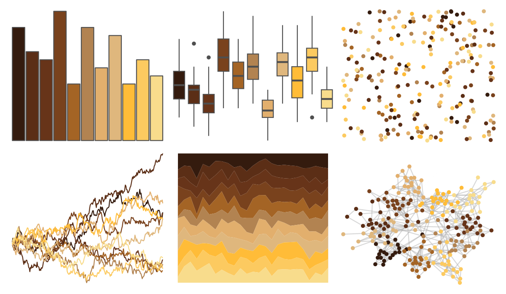

# beyonce - X86 

::: columns
::: {.column width="50%"}

**Github**

[dill/beyonce](https://github.com/dill/beyonce)
:::

::: {.column width="50%"}

**CRAN**

Not on CRAN
:::
:::

<hr> 

Use with [paletteer](https://emilhvitfeldt.github.io/paletteer/) package:

```r
library(paletteer)
paletteer_d("beyonce::X86")
```

Use raw:

```r
c("#341B0EFF", "#5B2E16FF", "#673419FF", "#79421DFF", "#A46425FF", "#B28351FF", "#E2AF6DFF", "#DFB77DFF", "#FFBC38FF", "#FCCA60FF", "#F8DC8CFF")
``` 

 

<br>

# Related Palettes

<div class="list" style="display: grid; grid-template-columns: auto auto auto;"> <figure class="figure">
<a href="../../amerika/Dem_Ind_Rep3/"> </a>
</figure> <figure class="figure">
<a href="../../beyonce/X59/"> </a>
</figure> <figure class="figure">
<a href="../../colRoz/a_plagiata/"> </a>
</figure> <figure class="figure">
<a href="../../palettetown/swinub/"> </a>
</figure> <figure class="figure">
<a href="../../soilpalettes/natrudoll/"> </a>
</figure> <figure class="figure">
<a href="../../beyonce/X16/"> </a>
</figure> <figure class="figure">
<a href="../../colRoz/a_westwoodi/"> </a>
</figure> <figure class="figure">
<a href="../../MetBrewer/Paquin/"> </a>
</figure> <figure class="figure">
<a href="../../PNWColors/Mushroom/"> </a>
</figure> <figure class="figure">
<a href="../../poisonfrogs/Rmarina/"> </a>
</figure> <figure class="figure">
<a href="../../poisonfrogs/Oscolon/"> </a>
</figure> <figure class="figure">
<a href="../../ggsci/amber_tw3/"> </a>
</figure> 
</div>
