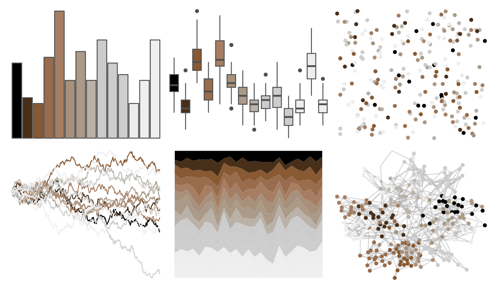
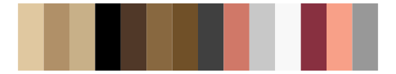

# beyonce - X87 

::: columns
::: {.column width="50%"}

**Github**

[dill/beyonce](https://github.com/dill/beyonce)
:::

::: {.column width="50%"}

**CRAN**

Not on CRAN
:::
:::

<hr> 

Use with [paletteer](https://emilhvitfeldt.github.io/paletteer/) package:

```r
library(paletteer)
paletteer_d("beyonce::X87")
```

Use raw:

```r
c("#000000FF", "#472F1AFF", "#885932FF", "#986C4CFF", "#A67E63FF", "#A8917CFF", "#AA9A87FF", "#BAB2A8FF", "#CCCCCCFF", "#CDCDCDFF", "#CECECEFF", "#EDEDEDFF", "#EEEEEEFF", "#EFEFEFFF")
``` 

 

<br>

# Related Palettes

<div class="list" style="display: grid; grid-template-columns: auto auto auto;"> <figure class="figure">
<a href="../../amerika/Dem_Ind_Rep3/"> </a>
</figure> <figure class="figure">
<a href="../../beyonce/X85/"> </a>
</figure> <figure class="figure">
<a href="../../trekcolors/terran/"> </a>
</figure> <figure class="figure">
<a href="../../palettetown/nincada/"> </a>
</figure> <figure class="figure">
<a href="../../ggsci/grey_material/"> </a>
</figure> <figure class="figure">
<a href="../../ggsci/brown_material/"> </a>
</figure> <figure class="figure">
<a href="../../palettetown/dodrio/"> </a>
</figure> <figure class="figure">
<a href="../../palettetown/medicham/"> </a>
</figure> <figure class="figure">
<a href="../../palettetown/slakoth/"> </a>
</figure> <figure class="figure">
<a href="../../Rdune/harkonnen3/"> </a>
</figure> <figure class="figure">
<a href="../../ggprism/black_and_white/"> </a>
</figure> <figure class="figure">
<a href="../../palettetown/anorith/"> </a>
</figure> 
</div>
