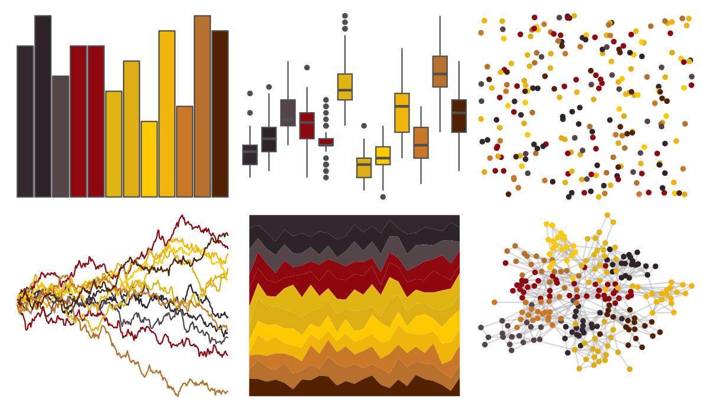

# beyonce - X88 

::: columns
::: {.column width="50%"}

**Github**

[dill/beyonce](https://github.com/dill/beyonce)
:::

::: {.column width="50%"}

**CRAN**

Not on CRAN
:::
:::

<hr> 

Use with [paletteer](https://emilhvitfeldt.github.io/paletteer/) package:

```r
library(paletteer)
paletteer_d("beyonce::X88")
```

Use raw:

```r
c("#332830FF", "#2D2429FF", "#544549FF", "#8F070FFF", "#90060EFF", "#E0B412FF", "#DCAE14FF", "#FDCA00FF", "#F0B50AFF", "#C97827FF", "#B7712CFF", "#512100FF")
``` 

 

<br>

# Related Palettes

<div class="list" style="display: grid; grid-template-columns: auto auto auto;"> <figure class="figure">
<a href="../../amerika/Dem_Ind_Rep3/"> </a>
</figure> <figure class="figure">
<a href="../../beyonce/X89/"> </a>
</figure> <figure class="figure">
<a href="../../nbapalettes/jazz_city/"> </a>
</figure> <figure class="figure">
<a href="../../nbapalettes/thunder_tribute/"> </a>
</figure> <figure class="figure">
<a href="../../beyonce/X34/"> </a>
</figure> <figure class="figure">
<a href="../../ggprism/greenwash/"> </a>
</figure> <figure class="figure">
<a href="../../Redmonder/qMSORd/"> </a>
</figure> <figure class="figure">
<a href="../../ggprism/beer_and_ales/"> </a>
</figure> <figure class="figure">
<a href="../../MoMAColors/Exter/"> </a>
</figure> <figure class="figure">
<a href="../../MetBrewer/Nattier/"> </a>
</figure> <figure class="figure">
<a href="../../beyonce/X86/"> </a>
</figure> <figure class="figure">
<a href="../../fishualize/Anisotremus_virginicus/"> </a>
</figure> 
</div>
