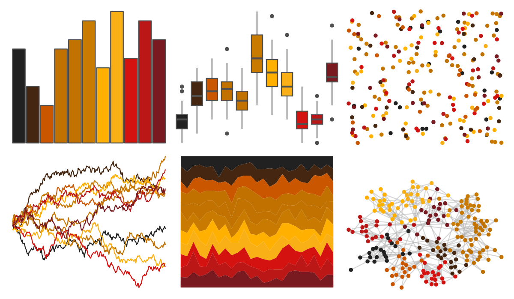

# beyonce - X89 

::: columns
::: {.column width="50%"}

**Github**

[dill/beyonce](https://github.com/dill/beyonce)
:::

::: {.column width="50%"}

**CRAN**

Not on CRAN
:::
:::

<hr> 

Use with [paletteer](https://emilhvitfeldt.github.io/paletteer/) package:

```r
library(paletteer)
paletteer_d("beyonce::X89")
```

Use raw:

```r
c("#212121FF", "#452711FF", "#CA5600FF", "#C17100FF", "#C17200FF", "#C97A00FF", "#FFB000FF", "#F8B016FF", "#D41311FF", "#BB1717FF", "#781A1FFF")
``` 

 

<br>

# Related Palettes

<div class="list" style="display: grid; grid-template-columns: auto auto auto;"> <figure class="figure">
<a href="../../amerika/Dem_Ind_Rep3/"> </a>
</figure> <figure class="figure">
<a href="../../nbapalettes/jazz_city/"> </a>
</figure> <figure class="figure">
<a href="../../beyonce/X88/"> </a>
</figure> <figure class="figure">
<a href="../../ggprism/beer_and_ales/"> </a>
</figure> <figure class="figure">
<a href="../../MetBrewer/Peru2/"> </a>
</figure> <figure class="figure">
<a href="../../ggprism/greenwash/"> </a>
</figure> <figure class="figure">
<a href="../../Redmonder/qMSORd/"> </a>
</figure> <figure class="figure">
<a href="../../MoMAColors/Alkalay1/"> </a>
</figure> <figure class="figure">
<a href="../../beyonce/X113/"> </a>
</figure> <figure class="figure">
<a href="../../nbapalettes/supersonics_90s/"> </a>
</figure> <figure class="figure">
<a href="../../poisonfrogs/Ohistrionica/"> </a>
</figure> <figure class="figure">
<a href="../../MexBrewer/Taurus1/"> </a>
</figure> 
</div>
