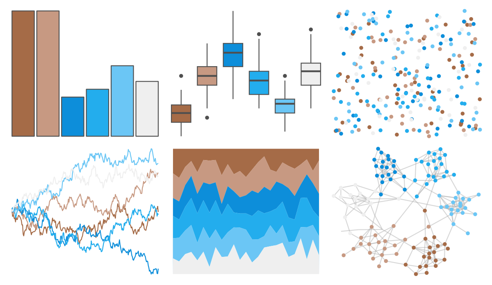

# beyonce - X9 

::: columns
::: {.column width="50%"}

**Github**

[dill/beyonce](https://github.com/dill/beyonce)
:::

::: {.column width="50%"}

**CRAN**

Not on CRAN
:::
:::

<hr> 

Use with [paletteer](https://emilhvitfeldt.github.io/paletteer/) package:

```r
library(paletteer)
paletteer_d("beyonce::X9")
```

Use raw:

```r
c("#A56B47FF", "#C79982FF", "#0D8EDAFF", "#23ADEDFF", "#6BC6F5FF", "#EFEFEFFF")
``` 

 

<br>

# Related Palettes

<div class="list" style="display: grid; grid-template-columns: auto auto auto;"> <figure class="figure">
<a href="../../amerika/Dem_Ind_Rep3/"> </a>
</figure> <figure class="figure">
<a href="../../MapPalettes/sunset/"> </a>
</figure> <figure class="figure">
<a href="../../beyonce/X129/"> </a>
</figure> <figure class="figure">
<a href="../../khroma/BuRd/"> </a>
</figure> <figure class="figure">
<a href="../../nationalparkcolors/MtRainier/"> </a>
</figure> <figure class="figure">
<a href="../../vangogh/SelfPortrait/"> </a>
</figure> <figure class="figure">
<a href="../../rcartocolor/TealRose/"> </a>
</figure> <figure class="figure">
<a href="../../beyonce/X55/"> </a>
</figure> <figure class="figure">
<a href="../../fishualize/Xyrichthys_novacula/"> </a>
</figure> <figure class="figure">
<a href="../../palettetown/pupitar/"> </a>
</figure> <figure class="figure">
<a href="../../lisa/JosefAlbers/"> </a>
</figure> <figure class="figure">
<a href="../../beyonce/X35/"> </a>
</figure> 
</div>
