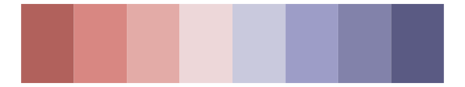

# beyonce - X90 

::: columns
::: {.column width="50%"}

**Github**

[dill/beyonce](https://github.com/dill/beyonce)
:::

::: {.column width="50%"}

**CRAN**

Not on CRAN
:::
:::

<hr> 

Use with [paletteer](https://emilhvitfeldt.github.io/paletteer/) package:

```r
library(paletteer)
paletteer_d("beyonce::X90")
```

Use raw:

```r
c("#795998FF", "#7D4D7FFF", "#954C84FF", "#AD5A88FF", "#D05F95FF", "#DAA7ABFF", "#F0A9A7FF", "#E7B7B2FF", "#EFCCB6FF", "#D1CAC8FF", "#B5C5D5FF")
``` 

 

<br>

# Related Palettes

<div class="list" style="display: grid; grid-template-columns: auto auto auto;"> <figure class="figure">
<a href="../../awtools/a_palette/"> </a>
</figure> <figure class="figure">
<a href="../../MetBrewer/Cassatt1/"> </a>
</figure> <figure class="figure">
<a href="../../ggthemes/Classic_Purple_Gray_12/"> </a>
</figure> <figure class="figure">
<a href="../../palettetown/zubat/"> </a>
</figure> <figure class="figure">
<a href="../../ggthemes/Classic_Purple_Gray_6/"> </a>
</figure> <figure class="figure">
<a href="../../ggthemes/Purple_Pink_Gray/"> </a>
</figure> <figure class="figure">
<a href="../../feathers/galah/"> </a>
</figure> <figure class="figure">
<a href="../../beyonce/X126/"> </a>
</figure> <figure class="figure">
<a href="../../palettetown/metang/"> </a>
</figure> <figure class="figure">
<a href="../../beyonce/X60/"> </a>
</figure> <figure class="figure">
<a href="../../palettetown/muk/"> </a>
</figure> <figure class="figure">
<a href="../../beyonce/X49/"> </a>
</figure> 
</div>
