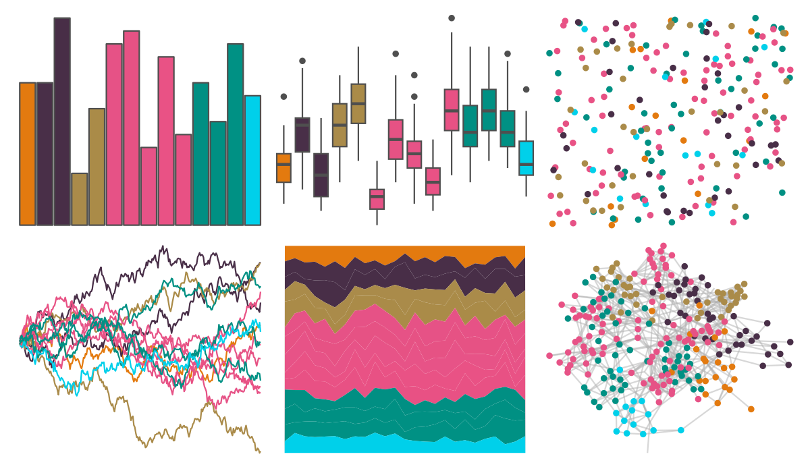

# beyonce - X94 

::: columns
::: {.column width="50%"}

**Github**

[dill/beyonce](https://github.com/dill/beyonce)
:::

::: {.column width="50%"}

**CRAN**

Not on CRAN
:::
:::

<hr> 

Use with [paletteer](https://emilhvitfeldt.github.io/paletteer/) package:

```r
library(paletteer)
paletteer_d("beyonce::X94")
```

Use raw:

```r
c("#E37A0FFF", "#492F48FF", "#482E47FF", "#AA8B4AFF", "#AA8B48FF", "#E65286FF", "#E65284FF", "#E75387FF", "#E95285FF", "#E85184FF", "#018F83FF", "#009083FF", "#009184FF", "#00D0EAFF")
``` 

 

<br>

# Related Palettes

<div class="list" style="display: grid; grid-template-columns: auto auto auto;"> <figure class="figure">
<a href="../../amerika/Dem_Ind_Rep3/"> </a>
</figure> <figure class="figure">
<a href="../../feathers/blue_winged_kookaburra/"> </a>
</figure> <figure class="figure">
<a href="../../werpals/uyuni/"> </a>
</figure> <figure class="figure">
<a href="../../rcartocolor/Prism/"> </a>
</figure> <figure class="figure">
<a href="../../beyonce/X73/"> </a>
</figure> <figure class="figure">
<a href="../../beyonce/X75/"> </a>
</figure> <figure class="figure">
<a href="../../MetBrewer/Demuth/"> </a>
</figure> <figure class="figure">
<a href="../../RColorBrewer/RdBu/"> </a>
</figure> <figure class="figure">
<a href="../../calecopal/figmtn/"> </a>
</figure> <figure class="figure">
<a href="../../ggprism/prism_dark2/"> </a>
</figure> <figure class="figure">
<a href="../../ggprism/prism_light/"> </a>
</figure> <figure class="figure">
<a href="../../unikn/pal_unikn_pair/"> </a>
</figure> 
</div>
