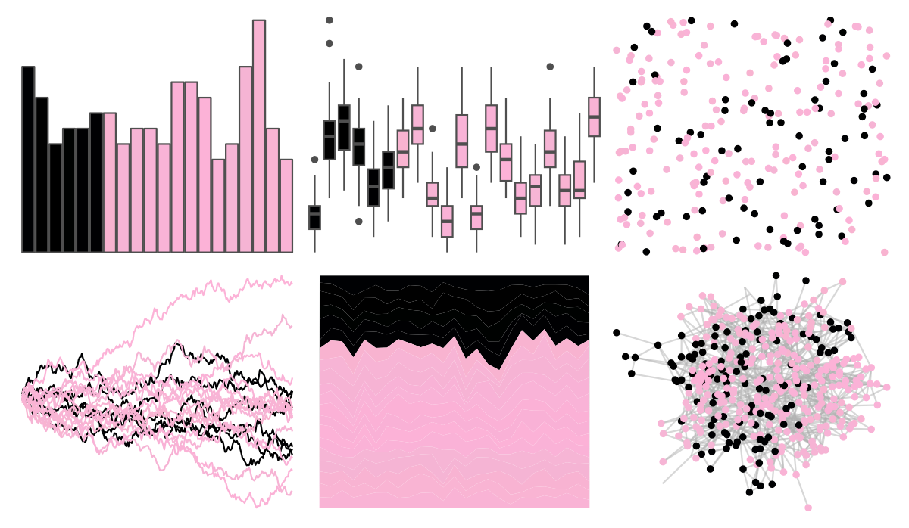
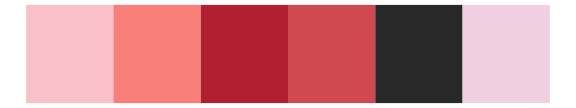
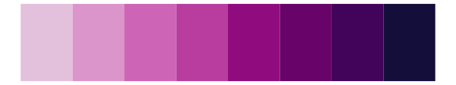

# beyonce - X95 

::: columns
::: {.column width="50%"}

**Github**

[dill/beyonce](https://github.com/dill/beyonce)
:::

::: {.column width="50%"}

**CRAN**

Not on CRAN
:::
:::

<hr> 

Use with [paletteer](https://emilhvitfeldt.github.io/paletteer/) package:

```r
library(paletteer)
paletteer_d("beyonce::X95")
```

Use raw:

```r
c("#000103FF", "#010101FF", "#000000FF", "#000201FF", "#000002FF", "#010103FF", "#F8B3D0FF", "#F7B4D5FF", "#F6B3D4FF", "#F8B2D6FF", "#F9B3D7FF", "#FBB1D6FF", "#F9B1D6FF", "#FCB2D7FF", "#FAB2D7FF", "#F6B5D5FF", "#F5B4D4FF", "#F8B3D2FF", "#F9B4D3FF", "#F9B3D5FF")
``` 

 

<br>

# Related Palettes

<div class="list" style="display: grid; grid-template-columns: auto auto auto;"> <figure class="figure">
<a href="../../awtools/a_palette/"> </a>
</figure> <figure class="figure">
<a href="../../ButterflyColors/hamadryas_feronia/"> </a>
</figure> <figure class="figure">
<a href="../../ButterflyColors/hamadryas_feronia/"> </a>
</figure> <figure class="figure">
<a href="../../Redmonder/sPBIRdPu/"> </a>
</figure> <figure class="figure">
<a href="../../beyonce/X26/"> </a>
</figure> <figure class="figure">
<a href="../../rcartocolor/Burg/"> </a>
</figure> <figure class="figure">
<a href="../../palettetown/ditto/"> </a>
</figure> <figure class="figure">
<a href="../../palettetown/mew/"> </a>
</figure> <figure class="figure">
<a href="../../beyonce/X14/"> </a>
</figure> <figure class="figure">
<a href="../../MoMAColors/Flash/"> </a>
</figure> <figure class="figure">
<a href="../../RColorBrewer/PuRd/"> </a>
</figure> <figure class="figure">
<a href="../../beyonce/X71/"> </a>
</figure> 
</div>
