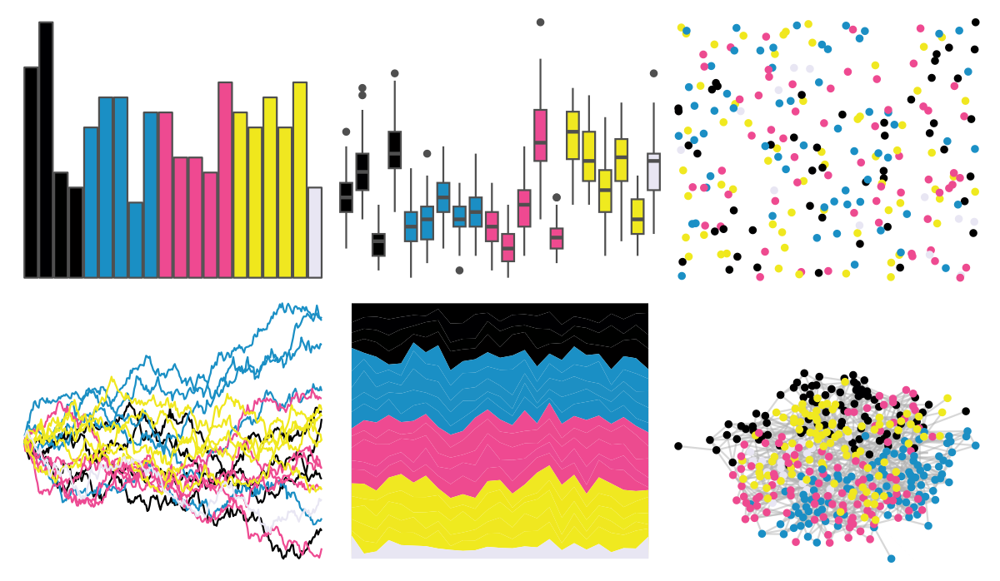

# beyonce - X96 

::: columns
::: {.column width="50%"}

**Github**

[dill/beyonce](https://github.com/dill/beyonce)
:::

::: {.column width="50%"}

**CRAN**

Not on CRAN
:::
:::

<hr> 

Use with [paletteer](https://emilhvitfeldt.github.io/paletteer/) package:

```r
library(paletteer)
paletteer_d("beyonce::X96")
```

Use raw:

```r
c("#000000FF", "#000002FF", "#000100FF", "#010000FF", "#1B90C6FF", "#1A8FC5FF", "#1D8FC3FF", "#1A8FC4FF", "#1B8EC4FF", "#EE4A91FF", "#EC4B8FFF", "#EF4991FF", "#EC4A93FF", "#EE4A8FFF", "#F0E821FF", "#F0E71CFF", "#EFEA1FFF", "#F0E720FF", "#F0E91FFF", "#E8E6F3FF")
``` 

 

<br>

# Related Palettes

<div class="list" style="display: grid; grid-template-columns: auto auto auto;"> <figure class="figure">
<a href="../../awtools/a_palette/"> </a>
</figure> <figure class="figure">
<a href="../../ButterflyColors/hamadryas_feronia/"> </a>
</figure> <figure class="figure">
<a href="../../ButterflyColors/hamadryas_feronia/"> </a>
</figure> <figure class="figure">
<a href="../../palettetown/roselia/"> </a>
</figure> <figure class="figure">
<a href="../../palettesForR/Paintjet/"> </a>
</figure> <figure class="figure">
<a href="../../PrettyCols/PinkGreens/"> </a>
</figure> <figure class="figure">
<a href="../../palettetown/manectric/"> </a>
</figure> <figure class="figure">
<a href="../../RColorBrewer/PiYG/"> </a>
</figure> <figure class="figure">
<a href="../../MoMAColors/Kippenberger/"> </a>
</figure> <figure class="figure">
<a href="../../palettetown/grovyle/"> </a>
</figure> <figure class="figure">
<a href="../../RColorBrewer/PRGn/"> </a>
</figure> <figure class="figure">
<a href="../../colorBlindness/Green2Magenta16Steps/"> </a>
</figure> 
</div>
