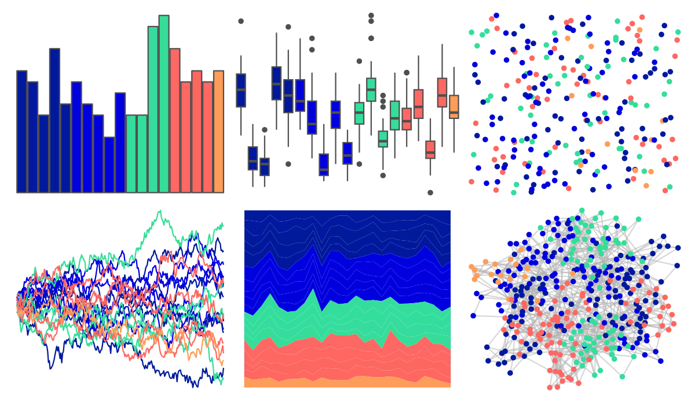

# beyonce - X97 

::: columns
::: {.column width="50%"}

**Github**

[dill/beyonce](https://github.com/dill/beyonce)
:::

::: {.column width="50%"}

**CRAN**

Not on CRAN
:::
:::

<hr> 

Use with [paletteer](https://emilhvitfeldt.github.io/paletteer/) package:

```r
library(paletteer)
paletteer_d("beyonce::X97")
```

Use raw:

```r
c("#01199DFF", "#02189FFF", "#001A9BFF", "#00199CFF", "#01179EFF", "#0001DFFF", "#0200DFFF", "#0000DFFF", "#0000DEFF", "#0101DFFF", "#34DD9CFF", "#33DE9CFF", "#36DC9EFF", "#36DD98FF", "#FD6864FF", "#FF6762FF", "#FC6760FF", "#FF6761FF", "#FE9D59FF")
``` 

 

<br>

# Related Palettes

<div class="list" style="display: grid; grid-template-columns: auto auto auto;"> <figure class="figure">
<a href="../../awtools/a_palette/"> </a>
</figure> <figure class="figure">
<a href="../../ButterflyColors/hamadryas_feronia/"> </a>
</figure> <figure class="figure">
<a href="../../ButterflyColors/hamadryas_feronia/"> </a>
</figure> <figure class="figure">
<a href="../../colorBlindness/Blue2DarkRed18Steps/"> </a>
</figure> <figure class="figure">
<a href="../../dichromat/DarkRedtoBlue_18/"> </a>
</figure> <figure class="figure">
<a href="../../trekcolors/lcars_2379/"> </a>
</figure> <figure class="figure">
<a href="../../beyonce/X76/"> </a>
</figure> <figure class="figure">
<a href="../../ggprism/prism_dark2/"> </a>
</figure> <figure class="figure">
<a href="../../ggprism/prism_light/"> </a>
</figure> <figure class="figure">
<a href="../../pals/tol/"> </a>
</figure> <figure class="figure">
<a href="../../MetBrewer/Manet/"> </a>
</figure> <figure class="figure">
<a href="../../colorBlindness/Blue2DarkRed12Steps/"> </a>
</figure> 
</div>
