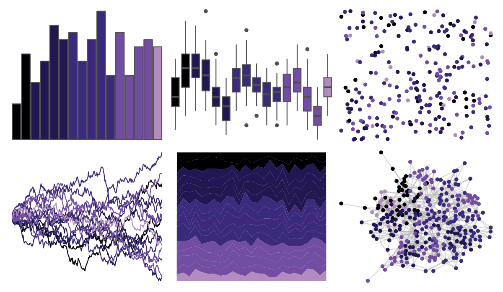

# beyonce - X98 

::: columns
::: {.column width="50%"}

**Github**

[dill/beyonce](https://github.com/dill/beyonce)
:::

::: {.column width="50%"}

**CRAN**

Not on CRAN
:::
:::

<hr> 

Use with [paletteer](https://emilhvitfeldt.github.io/paletteer/) package:

```r
library(paletteer)
paletteer_d("beyonce::X98")
```

Use raw:

```r
c("#000000FF", "#000004FF", "#211753FF", "#221654FF", "#22174FFF", "#221753FF", "#3C2A7CFF", "#382B7DFF", "#3E287BFF", "#392A7BFF", "#3B2A7AFF", "#714DA4FF", "#734DA2FF", "#704EA2FF", "#744CA2FF", "#B28CBFFF")
``` 

 

<br>

# Related Palettes

<div class="list" style="display: grid; grid-template-columns: auto auto auto;"> <figure class="figure">
<a href="../../amerika/Dem_Ind_Rep3/"> </a>
</figure> <figure class="figure">
<a href="../../beyonce/X112/"> </a>
</figure> <figure class="figure">
<a href="../../beyonce/X31/"> </a>
</figure> <figure class="figure">
<a href="../../beyonce/X68/"> </a>
</figure> <figure class="figure">
<a href="../../PrettyCols/Velvet/"> </a>
</figure> <figure class="figure">
<a href="../../MoMAColors/Flash/"> </a>
</figure> <figure class="figure">
<a href="../../beyonce/X120/"> </a>
</figure> <figure class="figure">
<a href="../../poisonfrogs/Dtazureus/"> </a>
</figure> <figure class="figure">
<a href="../../ghibli/KikiDark/"> </a>
</figure> <figure class="figure">
<a href="../../beyonce/X13/"> </a>
</figure> <figure class="figure">
<a href="../../futurevisions/trappest/"> </a>
</figure> <figure class="figure">
<a href="../../beyonce/X84/"> </a>
</figure> 
</div>
